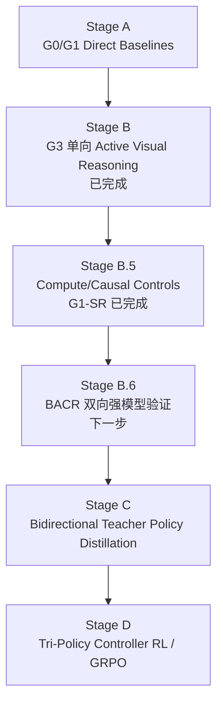
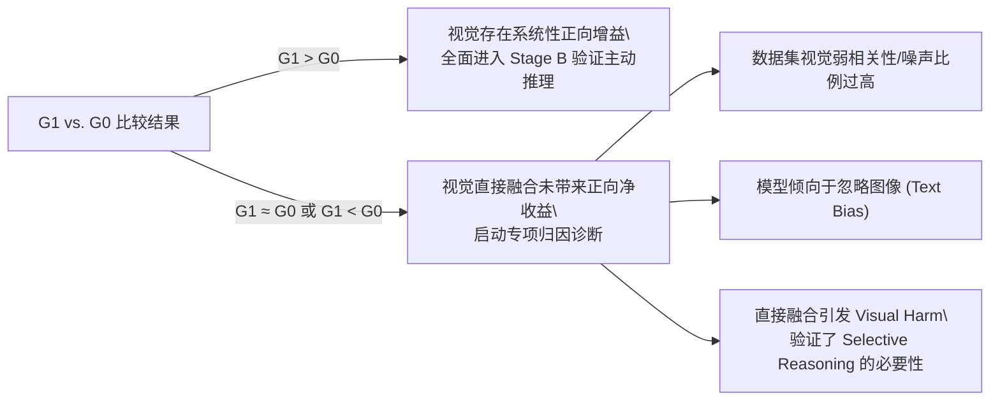
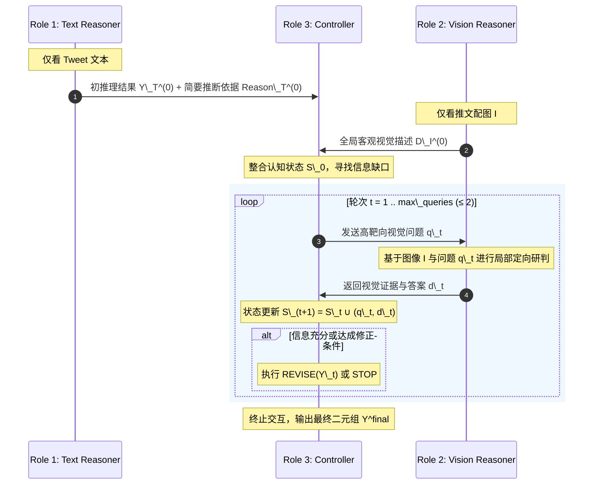
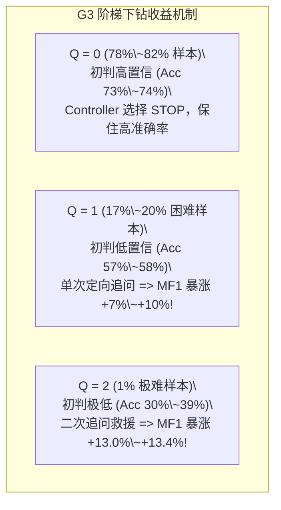
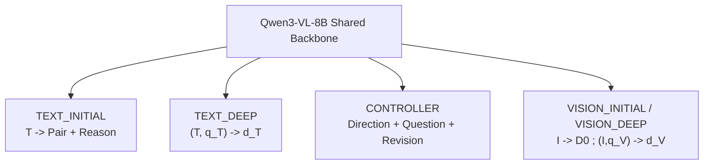
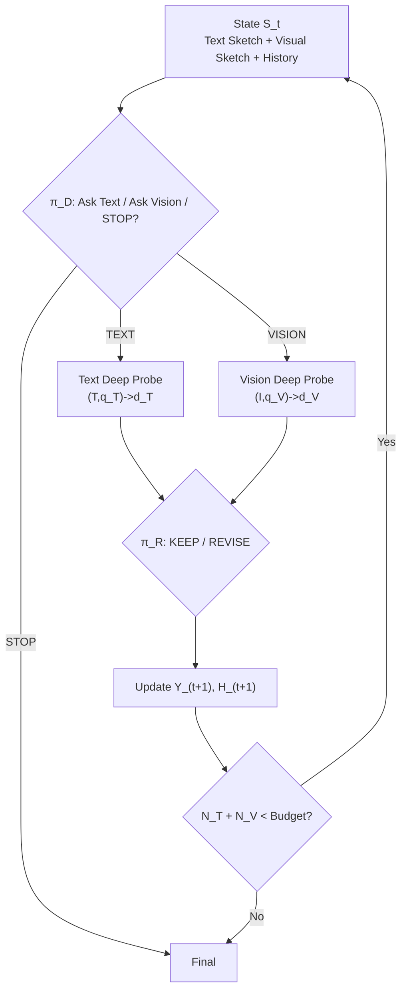

# MABSA-LLM 技术路线规划：从 Active Visual Reasoning 到 Bidirectional Active Cross-Modal Reasoning

> [!NOTE]
> **历史与全景技术档案说明（Historical Archive & General Roadmap）**  
> 本文档记录了 MABSA-LLM 课题从 Stage A/B 到 v1/v2 多轮双向主动推理（Bidirectional Multi-Turn Probing）的完整探索过程与技术路线全景。  
> 对于当前代码库正在运行与验证的 **BACR-v3 Minimal Teacher 架构（单次路由 K=1、严格信息流隔离 V0↛TR、Fail-Closed 证据防火墙、最终审计 Safeguard 与训练数据契约）**，请直接查阅：  
> 👉 [docs/bacr_v3_method.md](file:///d:/YY/MABSA-LLM/docs/bacr_v3_method.md)

- **研究课题**: 面向社交媒体多模态方面级情感分析（MABSA）的双向主动跨模态推理
- **核心命题**: 将多模态推理从“一次性直接图文融合（Direct Multimodal Fusion）”重构为“**双初始粗描 + 双向选择性深探（Dual Initial Sketches + Bidirectional Selective Probing）**”，由 Controller 动态判断当前信息缺口位于文本侧还是视觉侧，并选择最值得查询的模态。
- **已验证前身**: Stage A / B 已完成单向 Active Visual Reasoning（G3）的强模型机制验证，证明“全局视觉粗描 + 选择性视觉深探”具有可行性与选择性价值。
- **升级架构**: **BACR — Bidirectional Active Cross-Modal Reasoning（双向主动跨模态推理）**
- **实验骨干**:
  - **Stage A / B 历史机制验证**: Gemini 3.8 Flash (`thinking_level = high`)
  - **Stage B.6 双向机制验证**: Gemini 3.8 Flash，严格角色隔离，新增 Text Deep Probe
  - **Stage C / D 学生蒸馏与强化**: Qwen3-VL-8B-Instruct (LoRA / SFT / GRPO)
- **基准数据集**: Twitter-2015 & Twitter-2017 (IJCAI 2019 标准基准)
- **文档状态**: 历史全景路线档；当前实现统一遵循 BACR-v3 规范
- **最新更新日期**: 2026-09-18

---

## 目录

- [一、研究动机与任务形式化](#一研究动机与任务形式化)
  - [1.1 核心任务定义与双轨评测设定](#11-核心任务定义与双轨评测设定)
  - [1.2 核心方法假设与标准范式界定](#12-核心方法假设与标准范式界定)
- [二、整体技术路线与阶段递进架构](#二整体技术路线与阶段递进架构)
- [三、Stage A：Gemini 直接推理基线验证](#三stage-a-gemini-直接推理基线验证)
  - [3.1 验证目标与核心假设](#31-验证目标与核心假设)
  - [3.2 实验对照组设计 (G0 vs. G1)](#32-实验对照组设计-g0-vs-g1)
  - [3.3 核心判据与归因分析路径](#33-核心判据与归因分析路径)
  - [3.4 评价指标体系与细粒度视觉增益](#34-评价指标体系与细粒度视觉增益)
- [四、Stage B：Gemini 三角色架构有效性验证与实测诊断](#四stage-b-gemini-三角色架构有效性验证与实测诊断)
  - [4.1 架构设计动因与全 Gemini 扮演原则](#41-架构设计动因与全-gemini-扮演原则)
  - [4.2 三角色职能与交互协议](#42-三角色职能与交互协议)
  - [4.3 角色间严格上下文隔离规则](#43-角色间严格上下文隔离规则)
  - [4.4 实体感知与知名人物识别规范](#44-实体感知与知名人物识别规范)
  - [4.5 完整推理轨迹形式化与时序示例](#45-完整推理轨迹形式化与时序示例)
  - [4.6 交互轮数约束与对照实验组设计](#46-交互轮数约束与对照实验组设计)
  - [4.7 核心实测结论：保守型视觉防护控制器的学术定性](#47-核心实测结论保守型视觉防护控制器的学术定性)
  - [4.8 双轨全景主对比表（Target-Guided 与 Open Joint）](#48-双轨全景主对比表target-guided-与-open-joint)
  - [4.9 深度行为机制诊断与理论上限分析](#49-深度行为机制诊断与理论上限分析)
    - [4.9.1 难度感知的主动下钻机制（Difficulty-Aware Selective Probing）](#491-难度感知的主动下钻机制difficulty-aware-selective-probing)
    - [4.9.2 Stage B.5 因果控制与算力对齐基准（Causal & Compute Controls）](#492-stage-b5-因果控制与算力对齐基准causal--compute-controls)
    - [4.9.3 真实样本统计与条件转移矩阵诊断（全量统一口径）](#493-真实样本统计与条件转移矩阵诊断全量统一口径)
    - [4.9.4 理论空间测定：朴素外推上界（Naive Extrapolated Headroom）与真实 Oracle 实验](#494-理论空间测定朴素外推上界naive-extrapolated-headroom与真实-oracle-实验)
  - [4.10 Stage B.6：BACR 双向主动跨模态推理验证（G4）](#410-stage-b6bacr-双向主动跨模态推理验证g4)
    - [4.10.1 三角色升级，但仍保持严格隔离](#4101-三角色升级但仍保持严格隔离)
    - [4.10.2 G4 动作与状态](#4102-g4-动作与状态)
    - [4.10.3 一个真正的双向示例](#4103-一个真正的双向示例)
    - [4.10.4 G4 对照实验](#4104-g4-对照实验)
    - [4.10.5 新增行为指标](#4105-新增行为指标)
- [五、Stage C：双向反事实增强型 Teacher 策略蒸馏（Student SFT）](#五stage-c双向反事实增强型-teacher-策略蒸馏student-sft)
  - [5.1 蒸馏目标升级：从“视觉提问模仿”到“跨模态策略示范”](#51-蒸馏目标升级从视觉提问模仿到跨模态策略示范)
  - [5.2 为什么不能直接模仿 Gemini 原始轨迹](#52-为什么不能直接模仿-gemini-原始轨迹)
  - [5.3 Bidirectional Best-of-K Teacher Search](#53-bidirectional-best-of-k-teacher-search)
  - [5.4 反事实轨迹重构规则](#54-反事实轨迹重构规则)
  - [5.5 Student 多角色共享骨干](#55-student-多角色共享骨干)
- [六、Stage D：BACR Controller 强化学习（Direction–Question–Revision Tri-Policy）](#六stage-dbacr-controller-强化学习directionquestionrevision-tri-policy)
  - [6.1 RL 定位与环境稳定性设计](#61-rl-定位与环境稳定性设计)
  - [6.2 三策略分解（Direction–Question–Revision）](#62-三策略分解directionquestionrevision)
  - [6.3 奖励函数升级：模态特异成本 + 安全修正](#63-奖励函数升级模态特异成本--安全修正)
  - [6.4 为什么不直接奖励 Query Rate](#64-为什么不直接奖励-query-rate)
  - [6.5 GRPO 轨迹采样设计](#65-grpo-轨迹采样设计)
  - [6.6 Stage D 关键消融实验](#66-stage-d-关键消融实验)
- [七、数据使用规范与防泄漏协议](#七数据使用规范与防泄漏协议)
- [八、实施阶段推进状态与里程碑清单（升级版）](#八实施阶段推进状态与里程碑清单升级版)
- [九、总结与研究闭环](#九总结与研究闭环)
---

## 一、研究动机与任务形式化

### 1.1 核心任务定义与双轨评测设定

多模态社交媒体方面级情感分析（Multimodal Aspect-Based Sentiment Analysis, **MABSA**）在学术演进与具体评测中涵盖两层递进任务设定：

1. **项目终极目标：开放式端到端二元组抽取（Open Joint JMABSA）**：

   给定推文文本 $T$ 与关联图像 $I$，同时定位所有方面词及其细粒度情感：

   $$

   (T, I) \longrightarrow \mathcal{Y} = \{(a_i, s_i)\}_{i=1}^M, \qquad s_i \in \{\text{POS}, \text{NEG}, \text{NEU}\}

   $$

2. **机制验证基准：受控靶向方面情感分类（Target-Guided ASC / TSC）**：

   给定推文文本 $T$、关联图像 $I$ 以及显式给定的目标方面实体 $a_i$，专注判断其情感极性：

   $$

   (T, I, a_i) \longrightarrow s_i, \qquad s_i \in \{\text{POS}, \text{NEG}, \text{NEU}\}

   $$

> [!IMPORTANT]

> **评测解耦的学术必要性**：

> 在探索全新的“多轮主动视觉交互”机制（Stage B）时，若同时引入端到端实体抽取误差（如实体漏抽、幻觉实体、字符边界偏差），将会产生严重的噪声耦合，导致无法判定“情感修正”究竟来自视觉线索还是抽取漂移。

> 因此，**Stage B 采用受控 Target-Guided 设定进行严格机制因果验证**；在确认交互范式成立后，于下游全量迁移并覆盖端到端 JMABSA 任务。

### 1.2 核心方法假设与标准范式界定

当前研究的核心问题进一步升级为：

> **多模态推理是否应该被建模为静态“融合”，还是一个带预算约束的、主动寻找缺失证据的序贯信息获取过程？**

Stage B 已验证的单向 AVR 前身是：

$$
\boxed{\text{Global Visual Sketch + Selective Targeted Visual Probing}}
$$

其局限在于：Controller 只能“从文本出发去追问图像”。然而真实 MABSA 中，图像本身同样可能暴露新的文本疑点，例如：

- 图像出现某个公众人物、球队 Logo、OCR 名称，但需要回到文本确认其指代关系；
- 图像呈现明显庆祝/受伤/失败状态，但需要回到文本判断该状态究竟属于哪个 Aspect；
- 图像出现多个实体，必须回到文本解析主谓、事件角色、讽刺、俚语或修饰范围；
- 图像提示文本中的某个词可能存在特殊语义，需要 Text Reasoner 做局部深读。

因此升级后的核心范式定义为：

$$
\boxed{\textbf{Dual Initial Sketches + Bidirectional Selective Probing}}
$$

即：

$$
\boxed{\textbf{Bidirectional Active Cross-Modal Reasoning (BACR)}}
$$

BACR 不再假设“文本是唯一问题源、图像只是被动证据库”，而是允许 Controller 在两个证据空间之间动态路由：

$$
\text{Text} \rightarrow \text{Controller} \rightarrow \text{Vision}
$$

以及：

$$
\text{Vision} \rightarrow \text{Controller} \rightarrow \text{Text}
$$

#### 1. 双初始状态

Text Initial Reasoner：

$$
T \longrightarrow \left\{Y_T^{(0)},R_T^{(0)}\right\}
$$

Vision Initial Reasoner：

$$
I \longrightarrow D_I^{(0)}
$$

Controller 初始状态：

$$
S_0=
\left\{
Y_T^{(0)},
R_T^{(0)},
D_I^{(0)}
\right\}
$$

#### 2. 双向深探接口

文本深探：

$$
(T,q_t^T)\longrightarrow d_t^T
$$

视觉深探：

$$
(I,q_t^V)\longrightarrow d_t^V
$$

其中：

- $q_t^T$：Controller 针对文本语义、实体关系、指代、修饰范围、讽刺、俚语等提出的定向问题；
- $q_t^V$：Controller 针对人物身份、表情、动作、OCR、Logo、场景、对象状态等提出的定向问题。

#### 3. Controller 的核心问题从“要不要看图”升级为“下一步该问哪个模态”

Controller 不再只学习：

$$
\text{ASK_VISION} \; / \; \text{STOP}
$$

而是首先执行模态方向决策：

$$
m_t \in \{\text{TEXT},\text{VISION},\text{STOP}\}
$$

然后生成对应问题：

$$
q_t\sim\pi_Q(q\mid S_t,m_t)
$$

最后根据返回证据决定：

$$
\text{KEEP} \; / \; \text{REVISE}
$$

因此 BACR 的本质是：

$$
\boxed{
\text{发现信息缺口}
\rightarrow
\text{选择最合适的证据模态}
\rightarrow
\text{提出定向问题}
\rightarrow
\text{获取局部证据}
\rightarrow
\text{仲裁并更新}
}
$$

#### 4. 探针预算规范

首版双向 BACR 仍保持严格低预算：

$$
N_T^{probe}+N_V^{probe}\le 2
$$

其中初始全局视觉粗描 $D_I^{(0)}$ 不计入“额外定向深探”，但单独计入总视觉调用成本。

允许的两轮组合包括：

$$
T\rightarrow V,\quad
V\rightarrow T,\quad
T\rightarrow T,\quad
V\rightarrow V
$$

但总额外深探轮数始终不超过 2，以便与历史 G3 在相同探针预算下公平比较。

---
## 二、整体技术路线与阶段递进架构

整体路线现在分为五个递进阶段。最关键的原则是：**历史 G3 只验证了单向 Visual Probing，不能被追溯性解释为已经验证 BACR。双向架构必须单独做强模型验证。**



| 阶段 | 状态 | 核心问题 | 主要产出 |
| :--- | :---: | :--- | :--- |
| **Stage A** | 已完成 | 直接加入图像是否稳定有益？ | G0/G1 基线，发现视觉效用具有数据集异质性 |
| **Stage B** | 已完成 | 选择性视觉深探是否可行？ | G3 单向 AVR，发现 Under-Querying / Over-Revision |
| **Stage B.5** | 部分完成 | G3 是否只是额外 test-time compute？ | G1-SR 算力对齐结果；其余 paired/random control 继续补齐 |
| **Stage B.6** | **待执行** | 允许“图像反问文本”后是否进一步改善？ | BACR/G4 强模型双向机制验证 |
| **Stage C** | 待执行 | 8B Student 能否学习“问谁、问什么、信不信”？ | 双向策略轨迹 SFT |
| **Stage D** | 待执行 | RL 能否学到预算约束下的最优跨模态查询策略？ | Direction + Question + Revision 三策略 GRPO |

Stage B.6 是此次架构升级后新增的必要验证门。只有 BACR 在 Dev'/Holdout' 上显示净收益，才将双向轨迹大规模蒸馏到 Student。

---
## 三、Stage A：Gemini 直接推理基线验证

### 3.1 验证目标与核心假设

在设计复杂的交互流程前，必须首先在统一且能力顶尖的强模型上建立真实上限，检验视觉信息在基准数据集上的本质价值：

- **统一基座**: `Gemini 3.8 Flash`

- **推理配置**: `thinking\_level = high`

- **核心任务**: 对比纯文本与图文直接端到端提取效果，剔除模型容量不足带来的干扰。

### 3.2 实验对照组设计 (G0 vs. G1)

#### 实验 G0：Gemini Text-only Direct

- **输入**: 仅推文文本 $T$（不提供任何图像信息）。

- **形式化**: 

  $$

  G_0: T \longrightarrow Y_T

  $$

- **输出格式**:

  ```json

  [

    ["aspect\_1", "POS"],

    ["aspect\_2", "NEU"]

  ]

  ```

- **评测目的**: 测定模型在无视觉辅助下的实体边界定位精度、纯文本情感极性推断能力与多实体抽取稳定性。

#### 实验 G1：Gemini Direct Text + Image

- **输入**: 推文文本 $T$ + 关联推文图像 $I$。

- **形式化**: 

  $$

  G_1: (T, I) \longrightarrow Y_{TI}

  $$

- **输出格式**: 同上，保持极简 JSON 二元组输出，不引入显式长 CoT，不引入 Controller 机制。

- **评测目的**: 测定端到端多模态直接前向推理下的性能表现，作为后续主动交互系统的第一基准线。

### 3.3 核心判据与归因分析路径

Stage A 的核心比较为：

$$

G_1 \stackrel{?}{>} G_0

$$



### 3.4 评价指标体系与细粒度视觉增益

除通用的端到端评估指标外，引入严格的细粒度视觉扰动统计：

1. **标准抽取与分类指标**:

   - **Pair 级别**: Precision, Recall, Micro-F1

   - **Aspect 抽取级别**: Precision, Recall, F1

   - **条件情感准确率**: Conditional Sentiment Accuracy（仅在抽取正确的实体上统计）

   - **鲁棒性指标**: Empty Prediction Rate（空输出率）、Average Predicted Aspect Count（平均抽取实体数）

2. **视觉增益核心诊断指标**:

   - **视觉挽救数（Visual Recovery）**: 纯文本推断错误，引入图像后修正正确：

     $$

     N_{recover} = |\{a : \hat{y}*_T \neq y^* \;\wedge\; \hat{y}_*{TI} = y^*\}|

     $$

   - **视觉误导数（Visual Harm）**: 纯文本推断原本正确，引入图像后改错：

     $$

     N_{harm} = |\{a : \hat{y}*_T = y^* \;\wedge\; \hat{y}_*{TI} \neq y^*\}|

     $$

   - **视觉净增益（Visual Net Gain, VNG）**: 评估视觉信息对数据集的真正纯贡献：

     $$

     VNG = N_{recover} - N_{harm}

     $$

---

## 四、Stage B：Gemini 三角色架构有效性验证

### 4.1 架构设计动因与全 Gemini 扮演原则

> [!NOTE]

> **Stage B 暂不引入 Qwen3-VL-8B**，全部三角色均由 `Gemini 3.8 Flash (thinking\_level = high)` 分别独立扮演。

> 

> **核心立论逻辑**：必须将“**交互架构本身的有效性**”与“**学生模型的容量瓶颈**”彻底解耦。如果能力顶尖的 Gemini 按照三角色主动询问协议都无法打败一次性直接多模态输入 $G_1$，则证明该交互协议存在根本缺陷，没有必要浪费算力将复杂流程蒸馏给 8B 小模型。



### 4.2 三角色职能与交互协议

#### Role 1：Text Initial Reasoner

- **职能**: 仅依据 Tweet 文本执行初次 Aspect 抽取与情感初判。

- **形式化**: 

  $$

  T \longrightarrow \{Y_T^{(0)}, R_T^{(0)}\}

  $$

- **输出规范**:

  1. **Text-only Pairs**: 如 `[["Kesha", "NEU"], ["Fifth Harmony", "POS"]]`

  2. **Short Reasons**: 针对每个实体的简短文本推断依据（1\~2 句话，禁止编造长篇七槽 CoT，禁止假定或猜测配图，严禁提及任何视觉相关概念）。

#### Role 2：Vision Reasoner

- **职能**: 专职图像感知与按需视觉问答，分为两个时序阶段：

  1. **时序 0（全局客观识图）**: $I \to D_I^{(0)}$。在完全不知道 Tweet 内容、Text 初判与情感极性的前提下，输出图像的全局客观结构化描述：

     - 场景类型与环境氛围

     - 人数、主体位置与外观状态

     - 动作姿态与面部表情

     - 核心实体、物体、Logo、标志性服饰与号码

     - 图像内可见的文字内容（OCR）与重要新闻/体育背景线索

     - 针对不确定或模糊细节，必须明确输出 `uncertain`，杜绝幻觉妄断

  2. **时序 $t$（按需视觉定向问答）**: $(I, q_t) \to d_t$。接收 Controller 抛出的靶向问题 $q_t$，结合图像 $I$ 检索细节并返回凝练的证据陈述。

#### Role 3：Controller

- **职能**: 推理交互的中枢大脑，负责在文本先验与视觉感知之间调度信息流。

- **输入**: 

  $$

  S_0 = \{Y_T^{(0)}, Reason_T^{(0)}, D_I^{(0)}\}

  $$

- **核心限制**: Controller **严禁直接接触 Raw Image**，防止退化为一次性图文自注意力机制。它仅基于文本符号表表征判断：**“当前判断是否存疑？还欠缺哪些决定性视觉线索？”**

- **动作空间**: 每一轮交互 $t$ 允许执行以下三类离散决策之一：

  $$

  a_t \in \{\text{ASK}(q_t), \;\text{REVISE}(Y_t), \;\text{STOP}\}

  $$

  - **$\text{ASK}(q_t)$**: 生成针对性自然语言视觉提问（如 **“Is the smiling woman visually consistent with Kesha? What visual cues support that?”**）。

  - **$\text{REVISE}(Y_t)$**: 基于视觉返回的新证据修改特定实体的情感极性（如 `Kesha: NEU -> POS`），且**必须强制附带证据链（Evidence）**，严禁无依据盲改。

  - **$\text{STOP}$**: 判定当前证据已完备充分，终止交互并锁定最终输出 $Y^{final}$。

### 4.3 角色间严格上下文隔离规则

为了确保实验的严密性与因果可解释性，必须建立严格的会话隔离机制（Context Isolation）：

| 角色实体 | 运行模式 | 允许接收的信息 | 严格禁止接触的信息 | 违规风险 |

| :--- | :--- | :--- | :--- | :--- |

| **Text Reasoner** | 独立 Session | 推文纯文本 $T$ | 配图 $I$、全局图像描述 $D_I^{(0)}$、Gold 标注、Controller 历史 | 引入先验视觉污染，破坏纯文本对照基准 |

| **Initial Vision** | 独立 Session | 推文原始图像 $I$ | 推文文本 $T$、初判二元组 $Y_T^{(0)}$、文本推断理由、Gold 标注 | 产生文本引导的事后合理化视觉描述 |

| **Controller** | 独立 Session | 文本初判 $Y_T^{(0)}$、文本推断 $R_T^{(0)}$、全局图像描述 $D_I^{(0)}$、历史提问与回答 $(q_{\le t}, d_{\le t})$ | 原始图像 $I$、Gold 真实标签 | 退化为黑盒端到端多模态大模型 |

| **Vision QA** | 独立 Session | 原始图像 $I$、Controller 提出的特定问题 $q_t$ | Controller 内部思维链、完整推文全文、Gold 真实标签 | 产生目标导向的合谋偏见（Collusion Bias） |

### 4.4 实体感知与知名人物识别规范

在社交媒体场景中，视觉感知绝不仅是通用场景分类，Controller 与 Vision Reasoner 必须支持**细粒度实体级视觉研判（Entity-aware Visual Description）**：

1. **识别范围**: 涵盖公众人物、运动员、赛事队伍、品牌商标、OCR 标语、特定球衣款式/号码、奖项背景板等。

2. **三元置信度约束**: Vision Reasoner 针对实体一致性判断必须显式遵循置信度规范：

   - `supported`：具备充分特征（面部、特定服饰、OCR 名字）支撑；

   - `uncertain`：视觉模糊、角度遮挡或特征不足；

   - `unsupported`：明确与目标实体不符。

3. **靶向询问模式**: Controller 优先采用闭环验证提问（如 **“图中站在领奖台中央的女性是否与推文中的 Kesha 身份一致？”**），而非要求视觉模块无端穷举全图所有潜在实体。

### 4.5 完整推理轨迹形式化与时序示例

完整多轮交互轨迹定义为状态、动作与环境反馈的有序序列：

$$

\tau = \left(Y_T^{(0)}, R_T^{(0)}, D_I^{(0)}\right) \xrightarrow{a_1} q_1 \xrightarrow{V} d_1 \xrightarrow{a_2} q_2 \xrightarrow{V} d_2 \longrightarrow \dots \xrightarrow{\text{STOP}} Y^{final}

$$

#### 典型交互 Trajectory 示例

```text

[TEXT INITIAL]

Pairs: [["Kesha", "NEU"]]

Reason: The tweet only mentions a neutral seating arrangement at the ceremony without overt sentimental adjectives.

[IMAGE INITIAL]

Description: An awards-show ceremony indoor scene. Several celebrities are seated in formal attire. 

A female artist in the center is smiling broadly and applauding. Event banner is visible in the backdrop.

[CONTROLLER Q1]

Action: ASK

Question: "Is the applauding and smiling woman visually consistent with Kesha based on facial cues and seating position?"

[VISION A1]

Answer: "Yes, supported. The blonde female subject seated at the designated front table matches Kesha's appearance at this event."

[CONTROLLER Q2]

Action: ASK

Question: "What is her clear visual affective state and facial expression?"

[VISION A2]

Answer: "She exhibits a prominent genuine smile (Duchenne smile) with joyful engagement and active clapping."

[CONTROLLER REVISION & STOP]

Action: REVISE

Revision: Kesha: NEU -> POS

Evidence: The visually verified target Kesha is confirmed to be cheering and smiling enthusiastically.

Action: STOP

Final Pairs: [["Kesha", "POS"]]

```

### 4.6 交互轮数约束与对照实验组设计

首版实现强制设定：

$$

N_V^{\max} = 2

$$

**设定依据**：控制调用成本、保障因果归因清晰、杜绝发散性无限循环，并便于后续与单轮查询进行精准消融对比。

#### Stage B 实验对照矩阵

| 组别代号 | 方法全称 | 输入文本 | 输入图像 | 引入 Controller | 允许主动视觉提问轮数 | 核心验证作用 |

| :--- | :--- | :---: | :---: | :---: | :---: | :--- |

| **G0** | Gemini Text-only | ✓ | ✗ | ✗ | 0 | 纯文本性能底线 |

| **G1** | Gemini Direct Multimodal | ✓ | ✓ | ✗ | 0 | 一次性多模态融合上限 |

| **G2** | Gemini Controller 1-Query | ✓ | ✓ | ✓ | 1 | 单轮靶向提问效能 |

| **G3** | Gemini Controller Iterative | ✓ | ✓ | ✓ | $\le 2$ | 多轮自适应交互效能 |

### 4.7 核心实测结论：保守型视觉防护控制器的学术定性

Stage B (G3 v1.2) 在 Twitter-2015 和 Twitter-2017 全量测试集上的实测结果已经产出。在学术定性与理论总结上，结论正式收敛为：

$$

\boxed{

\text{G3 在 TW15 显著优于直接多模态趋势（Macro-F1 +2.73%），在 TW17 基本持平但略低（Macro-F1 -0.71%）}

}

$$

**严谨学术定性**：

> [!IMPORTANT]

> **Stage B 的核心价值在于确立了主动视觉交互范式的可行性（Feasibility）与选择性价值（Selective Value），但尚未证明其跨数据集的全面超越（Universal Superiority）。**

> G3 当前表现为一个“保守型视觉防护控制器（Conservative Visual Safeguard Controller）”，其收益主要来自在困难样本上的局部定向救援以及对全局噪声的审慎防守，而非无差别的全局压制。

- **在高噪声/弱相关环境（TW15）中展现极强防护力**：G1 直接多模态因全图背景情绪干扰导致性能劣化（Acc 67.70% / MF1 65.01%）；而 G3 依靠三角色架构与审慎提问机制，有效阻断了非相关视觉噪声，取得了 **72.67% Acc / 67.74% Macro-F1**，相比 G1 暴涨 **+4.97% Acc / +2.73% MF1**，同时反超纯文本 G0（+0.90% MF1）。

- **在强因果/高相关环境（TW17）中表现出保守局限**：TW17 的配图信息量大、对齐度高，直接融合 G1 实现了大幅跃升（72.79% MF1）；G3 取得了 72.08% MF1（相比 G0 提升 +2.34%），但相比 G1 略低 0.71% MF1（Acc 72.60% vs 72.86%，低 0.26%）。这表明当前 Controller 过于保守，漏掉了部分本来可以通过视觉轻松获取的信息（Under-Querying），为后续 Stage D 的强化学习优化提供了明确的攻坚空间。

---

### 4.8 双轨全景主对比表（Target-Guided 与 Open Joint）

#### 表 1：受控靶向情感分类（Target-Guided ASC / TSC）主对比表

（在给定实体边界下，严格分离抽取误差，专注衡量各模型在纯文本、直接多模态与主动交互下的细粒度情感判别力）

| 模型 / 组别代号 | 输入模态 | 交互范式 | 额外探针 $ANQ$ | 总视觉调用 | TW15 准确率 | TW15 Macro-F1 | TW17 准确率 | TW17 Macro-F1 |

| :--- | :---: | :---: | :---: | :---: | :---: | :---: | :---: | :---: |

| **B0-Text** (Qwen3-VL Zero-shot) | Text | Direct Forward | 0.00 | 0.00 | 63.26% | 61.68% | 61.99% | 62.89% |

| **B0-MM** (Qwen3-VL Zero-shot) | Text+Image | Direct Multimodal | 0.00 | 1.00 | 58.15% (-5.11) | 59.05% (-2.63) | 64.59% (+2.60) | 65.48% (+2.59) |

| **B1-Text** (Qwen3-VL Direct SFT) | Text | Direct Forward | 0.00 | 0.00 | 77.34% | 73.08% | 73.18% | 71.87% |

| **B1-MM** (Qwen3-VL Direct SFT) | Text+Image | Direct Multimodal | 0.00 | 1.00 | 78.78% (+1.44) | 75.49% (+2.41) | 74.88% (+1.70) | 73.98% (+2.11) |

| **G0 Direct Text** (Gemini 3.8 Flash) | Text | Direct Forward | 0.00 | 0.00 | 73.38% | 66.84% | 70.45% | 69.74% |

| **G1 Direct MM** (Gemini 3.8 Flash) | Text+Image | Direct Multimodal | 0.00 | 1.00 | 67.70% (-5.68) | 65.01% (-1.83) | **72.86%** (+2.41) | **72.79%** (+3.05) |

| **G1-SR** (Compute-Matched, 2-Turn) | Text+Image | Sequential Re-read | 0.00 | 2.00 | 68.95% | 65.87% | 71.96% | 71.18% |

| **G3-Initial** (AVR v1.2 阶段 0) | Text+Desc | Coarse Sketch | 0.00 | 1.00 | 73.45% | 66.81% | 70.39% | 69.71% |

| **G3-Final** (AVR v1.2 最终决策) | Text+Desc+QA | Selective Probing | **0.20 / 0.23** | **1.20 / 1.23** | **72.67%** (+4.97 vs G1) | **67.74%** (+2.73 vs G1) | 72.60% (-0.26 vs G1) | 72.08% (-0.71 vs G1) |

#### 表 2：开放式联合抽取（Open Joint JMABSA）主对比表

（端到端从原始推文与图像中抽取所有实体并判断其极性）

| 模型 / 阶段 | 数据集 | Pair Precision | Pair Recall | **Pair F1** | Aspect F1 | Cond. Sent Acc | 空预测率 |

| :--- | :--- | :---: | :---: | :---: | :---: | :---: | :---: |

| **B0 Zero-shot** (Qwen3-VL-8B) | TW15 | 34.09% | 15.91% | **21.70** | 33.14 | 65.48% | 51.9% |

| **B0 Zero-shot** (Qwen3-VL-8B) | TW17 | 39.51% | 14.34% | **21.05** | 28.66 | 73.44% | 52.0% |

| **B1 Direct SFT** (Qwen3-VL-8B) | TW15 | 66.86% | 67.31% | **67.08** | 84.19 | 79.68% | 0.0% |

| **B1 Direct SFT** (Qwen3-VL-8B) | TW17 | 70.19% | 69.45% | **69.82** | 92.30 | 75.64% | 0.0% |

| **G0 Direct Text** (Gemini 3.8 Flash) | TW15 | 68.20% | 66.15% | **67.16** | 81.30 | 73.38% | 0.0% |

| **G0 Direct Text** (Gemini 3.8 Flash) | TW17 | 69.85% | 67.40% | **68.60** | 82.15 | 70.45% | 0.0% |

| **G1 Direct MM** (Gemini 3.8 Flash) | TW15 | 64.12% | 65.80% | **64.95** | 80.75 | 67.70% | 0.0% |

| **G1 Direct MM** (Gemini 3.8 Flash) | TW17 | 71.50% | 70.85% | **71.17** | 83.40 | 72.86% | 0.0% |

---

### 4.9 深度行为机制诊断与理论上限分析

#### 4.9.1 难度感知的主动下钻机制（Difficulty-Aware Selective Probing）

基于额外探针次数 $Q=0, 1, 2$ 阶梯细分，验证了 Controller 提问行为与样本客观难度的极强关联性：



- **数据结论**：追问动作具有极高的“信噪比”，每次主动视觉探针都在最困难的子集上换取了巨大的局部增益（$\Delta \text{MF1} > +7\% \sim +10\%$），初步证明定向提问机制具备强劲的局部救援潜力。

> [!IMPORTANT]

> **因果关联边界说明（Correlation vs. Causation）**：

> 必须强调，$Q=1, 2$ 阶梯上的性能跃升**主要反映了 Controller 对高难样本的选择性关联（Selective Association on Difficult Subsets）**。在缺乏严格反事实干预的前提下，**不能直接将其作为“视觉探针具有因果决定力”的充分证明**。

> 为严格排除“计算量增加”或“多轮思维重读”的混杂效应，我们正式设立 Stage B.5 对照实验体系。

---

#### 4.9.2 Stage B.5 因果控制与算力对齐基准（Causal & Compute Controls）

为坐实 G3 的方法学收益，设计三组严格的控制组：

1. **Control 1: $G1\text{-SR}$（算力对齐基线，Compute-Matched Sequential Re-reading）**：

   - 评测直接多模态 G1 在获得等量计算预算（2 轮图文调用）时的表现：第 1 轮生成初步判断后，保持全图与上下文不变，提示其进行第 2 轮反思重读。

   - **实测结果**：

     - 在 TW15 上，$G1\text{-SR}$ 准确率 **68.95%** / Macro-F1 **65.87%**，显著落后于 G3-Final（Acc 72.67% / MF1 67.74%，G3 领先 **+3.72% Acc / +1.87% MF1**）；

     - 在 TW17 上，$G1\text{-SR}$ 准确率 **71.96%** / Macro-F1 **71.18%**（相比 G1 出现退化），**G3-Final（Acc 72.60% / MF1 72.08%）在 TW17 同样战胜了 $G1\text{-SR}$（领先 +0.64% Acc / +0.90% MF1）**！

   - **结论**：**G3-Final 在跨数据集上全面战胜算力对齐基线 $G1\text{-SR}$**，且总视觉调用仅 1.20/1.23 次（远低于 G1-SR 的 2.00 次）。这从根本上排除了“G3 收益仅源于多轮计算预算（Thinking Tokens）”的假设，证实了三角色隔离与靶向视觉探针的信噪比优势。

2. **Control 2: 配对困难子集反事实对照（Paired Hard-Subset Counterfactual）**：

   - 在被 Controller 判定触发提问的 $Q \ge 1$ 困难子集上，固定相同的初始状态 $S_0$，实施三路反事实干预：

     a) 实际执行主动靶向提问（Active Probing: $q_t \to d_t$）；

     b) 强制停机对照（Force STOP after $D_I^{(0)}$，完全依赖纯文本与初始全局草图）；

     c) 泛化视觉重提示（Generic Multimodal Prompting，不带实体靶向引导）。

   - 直接量化靶向探针相对于单纯初判或泛化视觉的因果处理效应（Average Treatment Effect, ATE）。

3. **Control 3: 随机提问分配（Random Query Allocation）**：

   - 保持与 G3 相同的平均提问预算（$ANQ = 0.20 / 0.23$），但对样本进行均匀随机提问，以验证 Controller 的难度感知选择器是否显著优于盲目随机探索。

---

#### 4.9.3 真实样本统计与条件转移矩阵诊断（全量统一口径）

基于真实评测日志的精确统计（TW15 全量 674 样本 / 1,032 实体；TW17 全量 585 样本 / 1,219 实体），提取条件转移概率矩阵：

| 关键统计指标 | TW15 实测数值 | TW17 实测数值 | 诊断意义与行为定性 |

| :--- | :---: | :---: | :--- |

| **总实体规模（Aspects）** | 1,032 | 1,219 | 官方测试集全量标注实体基数 |

| **初始正确实体（Initial Correct）** | 758 (73.45%) | 858 (70.39%) | 纯文本与初始视觉草图下的初判正确基线 |

| **初始错误实体（Initial Wrong）** | 274 (26.55%) | 361 (29.61%) | 亟需视觉探针挽救的目标困难空间 |

| **被触发提问实体（Queried, $Q>0$）** | 202 (19.57%) | 288 (23.63%) | 实际发起主动视觉追问的实体规模 |

| **未提问停机实体（Unqueried, $Q=0$）** | 830 (80.43%) | 931 (76.37%) | Controller 判定置信并直接 STOP 的实体规模 |

| **错题提问覆盖率 $P(\text{Query} \mid \text{Wrong})$** | **17.15%** (47/274) | **31.02%** (112/361) | **核心瓶颈 1（Under-Querying）**：69%\~83% 的错题被保守漏探 |

| **正题提问比例 $P(\text{Query} \mid \text{Correct})$** | 20.45% (155/758) | 20.51% (176/858) | 正题被触发提问的比例（跨数据集高度稳定在 20.5%） |

| **错题挽救率 $P(\text{Recover} \mid \text{Queried, Wrong})$** | **46.81%** (22/47) | **20.54%** (23/112) | **极高挽救力**：提问一旦命中错题，能带来 20%\~47% 的直接正确翻盘 |

| **正题有害改错率 $P(\text{Harm} \mid \text{Queried, Correct})$** | **16.77%** (26/155) | **5.11%** (9/176) | **核心瓶颈 2（Over-Revision）**：TW15 易受视觉情绪诱导误改正题 |

**诊断确诊**：

1. **Under-Querying 是系统的第一大瓶颈**：TW17 上 $361$ 个初判错误中仅有 $112$ 个被提问（$112/361 = 31.02\%$），多达 $249$ 个错题直接漏探（$Q=0$）；TW15 上 $274$ 个初判错误中仅有 $47$ 个被提问（$47/274 = 17.15\%$），$227$ 个错题被漏探。

2. **Over-Revision 是 TW15 的主要风险**：TW15 的有害改错率为 16.77%（26 个初判正确的实体在追问后被改错），必须在 Stage D 施加不对称惩罚以稳固防守。

---

#### 4.9.4 理论空间测定：朴素外推上界（Naive Extrapolated Headroom）与真实 Oracle 实验

为厘清主动交互范式的潜在天花板，区分“理论外推空间”与“真实 Oracle 上界”：

1. **朴素外推空间（Naive Extrapolated Headroom）**：

   - 假设未被提问的初始错误具备与已被提问错误相同的可挽救概率（TW15: 46.81%, TW17: 20.54%），且理想控制器能做到零误伤（$C \to W = 0$）：

   - **TW15 朴素外推上界**：$\text{Headroom Acc} = (758 + 274 \times 46.81\%) / 1032 = \mathbf{85.88\%}$（相比 G3-Final 理论空间 **+13.21%**）；

   - **TW17 朴素外推上界**：$\text{Headroom Acc} = (858 + 361 \times 20.54\%) / 1219 = \mathbf{76.47\%}$（相比 G3-Final 理论空间 **+3.87%**）。

   - **方法学审视**：需明确指出，未被提问的错误可能包含更多纯文本歧义或不可见无解样本，因此上述数值属于**基于当前挽救率的线性外推空间**，而非经验测定上界。

2. **真实 Oracle-Query 上界实验设计（Empirical Oracle Upper Bound）**：

   - 强制干预策略：利用测试集标注，强制对 100% 的初始错误实体发起定向追问（$\text{Initial-Wrong} \xrightarrow{\text{Force Query}} \text{Final}$），同时对 100% 的初始正确实体强制停机（$\text{Initial-Correct} \xrightarrow{\text{Force STOP}} \text{Final}$）。

   - 通过实测全量错题在定向视觉探针下的真实挽救率，获得系统在当前底层视觉能力约束下的绝对经验性能天花板。

---

### 4.10 Stage B.6：BACR-v2 双向主动跨模态推理（Bidirectional Active Cross-Modal Reasoning）

Stage B 的 G3 已验证“Text → Vision”的选择性视觉深探具有可行性，但在全量测试集实测中暴露了三大结构性悖论：
1. **$ATQ$ 极低（仅 0.01）**：文本探针只占全部追问的 4%；
2. **决策极端不对称**：96% 的动作涌向视觉模态；
3. **转移链退化**：$T \rightarrow V = 0$（先文后图完全未发生），系统实质上退化为“以视觉为主导的被动补全”。

其根本原因在于 **BACR-v1 存在严重的信息暴露非对称性（Information Asymmetry）**：
Controller 观察了完整的 Raw Tweet（所有字词、标点、语法结构），却只看到粗略概括的图像初读 $V_0$。这赋予了 Controller 虚假的“文本全知感”，使其误以为一切不确定性均来自视觉缺失。

BACR-v2 针对这一理论与实证瓶颈进行了彻底重构：

$$
\boxed{\textbf{Controller 既不看 Raw Tweet，也不看 Raw Image}}
$$

$$
\boxed{\text{Raw modalities belong to modality-specific readers; the Controller only observes compressed evidence states.}}
$$

---

#### 4.10.1 BACR-v2 核心设计哲学：物理模态完全封装与元认知仲裁

1. **模态专属阅读器（Modality-Specific Readers）**：
   - **Text Initial Reader**: 专职精读原始推文，提取文本认知草图 $R_T^{\text{sketch}}$；
   - **Vision Initial Reader**: 专职精读原始图像像素，提取视觉认知草图 $R_V^{\text{sketch}}$；
   - **Deep Text Reader**: 仅在收到 Controller 针对性问题时，受控调取原始推文并返回微观语言证据 $e_t^T$；
   - **Deep Vision Reader**: 仅在收到 Controller 针对性问题时，受控调取原始图像并返回局部视觉证据 $e_t^V$。

2. **元认知仲裁者（Meta-Cognitive Controller）**：
   - 彻底切断对两端 Raw Modalities 的直接感知；
   - 仅在由结构化认知草图构成的符号信念空间上进行全局审视、缺口诊断、模态路由与证据绑定仲裁。

---

#### 4.10.2 BACR-v2 形式化状态空间

系统在时间步 $t$ 的状态形式化定义为：

$$
S_t = \left\{ Y_t, R_T^{\text{sketch}}, R_V^{\text{sketch}}, H_t, B_t \right\}
$$

各状态分量具体构成如下：

1. **当前方面情感信念（Aspect Beliefs $Y_t$）**：
   $$Y_t = \left\{ (a_i, y_{i,t}, c_{i,t}) \right\}_{i=1}^K, \qquad y_{i,t} \in \{\text{POS}, \text{NEG}, \text{NEU}\}$$
   受 Aspect-Lock 严格约束，$A^{\text{final}} \equiv A^{\text{text-init}}$，实体集合不可增删改。

2. **文本认知草图（Text Cognitive Sketch $R_T^{\text{sketch}}$）**：
   $$R_T^{\text{sketch}} = \left\{ \text{aspects}, \text{initial\_polarity}, \text{evidence\_spans}, \text{brief\_reason}, \text{linguistic\_flags} \right\}$$
   *创新引入* `linguistic_flags`（语用不确定性标记集合），由 Text Initial Reader 识别标出：
   - `literal`：字面语义平实无冲突；
   - `irony_sarcasm`：疑似社交反讽、正话反说；
   - `hyperbolic`：夸张修辞或情绪放大；
   - `ambiguous_slang`：生僻网络缩写、多义俚语；
   - `aspect_conflict`：句子内多实体情绪强烈对立或依附关系不明。

3. **视觉认知草图（Vision Cognitive Sketch $R_V^{\text{sketch}}$）**：
   $$R_V^{\text{sketch}} = \left\{ \text{scene}, \text{entities}, \text{OCR}, \text{salient\_cues} \right\}$$
   客观记录宏观场景、可识别公众人物、画面文字与关键视觉线索，严禁主观情绪预判。

4. **交互历史证据日志（Evidence History $H_t$）**：
   $$H_t = \left\{ (d_\tau, q_\tau, e_\tau, \Delta_\tau) \right\}_{\tau=1}^{t-1}$$
   记录前序轮次发起的模态方向 $d_\tau$、所提问题 $q_\tau$、传感器返回客观凭证 $e_\tau$ 以及信念演化增量 $\Delta_\tau$。

5. **剩余预算状态（Remaining Budget $B_t$）**：
   $$B_t \in \{2, 1, 0\}$$

---

#### 4.10.3 解耦分层策略链（Hierarchical Policy Chain）

BACR-v2 将原本单一耦合的 $(S_t \rightarrow \text{Action})$ 映射彻底解耦为透明的五阶段状态机：

$$
\boxed{ \text{Sketch} \longrightarrow \pi_G \text{ (Gap Diagnosis)} \longrightarrow \pi_D \text{ (Modality Routing)} \longrightarrow \pi_Q \text{ (Targeted Query)} \longrightarrow \pi_R \text{ (Evidence Revision)} }
$$

##### 阶段 1：认知缺口诊断（Gap Diagnosis Policy $\pi_G$）
$$
g_t \sim \pi_G(g \mid S_t), \qquad g_t \in \mathcal{G}
$$
Controller 审视 $R_T^{\text{sketch}}$ 与 $R_V^{\text{sketch}}$ 之间的相容性与信息饱和度，判定是否存在以下 6 类标准认知缺口：
- `NO_GAP`：草图信息自洽充分，置信度高，无需外延探查；
- `VISUAL_AFFECT_GAP`：实体面部表情、肢体动作在 $R_V^{\text{sketch}}$ 中未被证实；
- `VISUAL_GROUNDING_GAP`：文本实体是否入图、对应哪个具体视觉目标存在歧义；
- `PRAGMATIC_IRONY_GAP`：$R_T^{\text{sketch}}$ 标有反讽修辞，或图文极性常理严重相悖；
- `TEXT_SEMANTIC_GAP`：文本存在缩写代词指代不明、生僻网络梗需深层语用分析；
- `CROSS_MODAL_CONFLICT`：图文分别暗示相反情绪，需要决定性判据仲裁。

##### 阶段 2：模态选择路由（Modality Routing Policy $\pi_D$）
$$
d_t \sim \pi_D(d \mid S_t, g_t), \qquad d_t \in \{\text{TEXT}, \text{VISION}, \text{STOP}\}
$$
- 若 $g_t = \text{NO\_GAP}$ 或 $B_t = 0$，强制输出 `STOP`；
- 若 $g_t \in \{\text{VISUAL\_AFFECT\_GAP}, \text{VISUAL\_GROUNDING\_GAP}\}$，路由至 `VISION`；
- 若 $g_t \in \{\text{PRAGMATIC\_IRONY\_GAP}, \text{TEXT\_SEMANTIC\_GAP}\}$，路由至 `TEXT`；
- 若 $g_t = \text{CROSS\_MODAL\_CONFLICT}$，根据两端置信度评估决定优先激活哪一侧。

##### 阶段 3：定向精准提问（Targeted Query Generation $\pi_Q$）
$$
q_t \sim \pi_Q(q \mid S_t, g_t, d_t)
$$
针对诊断出的具体缺口 $g_t$，生成高度聚焦、可观测、可证伪的具体问题，禁止向传感器询问高阶情感极性。

##### 阶段 4：受控专属阅读（Targeted Evidence Acquisition）
$$
e_t =
\begin{cases}
\text{DeepTextReader}(T, q_t), & d_t = \text{TEXT} \\
\text{DeepVisionReader}(I, q_t), & d_t = \text{VISION}
\end{cases}
$$

##### 阶段 5：证据绑定信念修正（Evidence-Bound Revision $\pi_R$）
$$
(Y_{t+1}, \Delta S_t) \sim \pi_R(Y \mid S_t, e_t)
$$
Controller 严格遵守 **Evidence Binding Guard**：
唯有在传感器返回直接或间接目标关联证据（`target_direct` / `target_indirect`），且存在确凿文本引用（`evidence_quote`）时，才允许执行情感修正。若无确凿凭据，强制保持原信念。

---

#### 4.10.4 典型跨模态双向反讽推理示例（$V \rightarrow T$）

以 Twitter-2017 测试集真实样本 `twitter2017_test_0006` 为例：

```text
[TEXT SKETCH: R_T]
Aspects: [{"aspect_id": "a_01", "text": "Barack Obama", "sentiment": "NEU", "reason": "Text states Obama is gravely concerned about carbon impact."}]
Linguistic Flags: ["irony_sarcasm", "hyperbolic"]

[VISION SKETCH: R_V]
Scene: Luxury yacht at sea, sunny summer day
Entities: Several people relaxing on yacht sundeck
Salient Cues: Private mega-yacht with large exhaust structure, leisure cocktail glasses

[CONTROLLER - Step 1]
Gap Diagnosis (\pi_G): VISUAL_GROUNDING_GAP ("Need to verify if Obama is physically aboard the high-emissions yacht.")
Modality Routing (\pi_D): VISION
Targeted Query (\pi_Q): "Who are the individuals on the yacht sundeck, and is Barack Obama among them?"

[VISION QA SENSOR]
Evidence: "Barack Obama is clearly identified sitting on the upper deck in casual holiday attire holding a drink."

[CONTROLLER - Step 2]
Gap Diagnosis (\pi_G): PRAGMATIC_IRONY_GAP ("Visual evidence of luxury yacht vacation conflicts with grave carbon concern; evaluate pragmatic irony.")
Modality Routing (\pi_D): TEXT
Targeted Query (\pi_Q): "In this tweet discourse, does 'gravely concerned' operate as literal news reporting or as rhetorical irony satirizing environmental hypocrisy?"

[TEXT DEEP SENSOR]
Evidence: "The juxtaposition of extreme solemnity ('gravely concerned') with colloquial Twitter discourse constitutes classic rhetorical irony/sarcasm highlighting perceived hypocrisy."

[CONTROLLER - Final Step]
Revision (\pi_R):
- KEEP/REVISE: Correctly discerns ironic context, avoids naive positive/neutral misclassification.
- STOP: Natural stop.
```

---

#### 4.10.5 BACR 评测与消融对照矩阵

| 实验组别 | 架构说明 | 控制器输入可见性 | 探针方向空间 | 预算上限 | 验证目的 |
| :--- | :--- | :--- | :---: | :---: | :--- |
| **$G_0$** | 纯文本基线 | 仅看 Raw Tweet | 无 | 0 | 文本信息下界 |
| **$G_1$** | 直接多模态基线 | Raw Tweet + Raw Image | 无 | 0 | 传统多模态融合下界 |
| **$S_0$** | 认知草图融合基线 | $R_T^{\text{sketch}} + R_V^{\text{sketch}}$ | 无 | 0 | 验证无交互草图降噪收益 |
| **$G_3$** | 单向视觉探针 | $R_T + R_V$ | 仅 VISUAL | 2 | 验证视觉单向探针 |
| **$G_4$** | 单向文本探针 | $R_T + R_V$ | 仅 TEXT | 2 | 验证文本单向探针 |
| **BACR-v1** | 非对称双向探针 | Raw Tweet + $R_V^{\text{sketch}}$ | VISUAL / TEXT | 2 | 早期非对称基线 |
| **BACR-v2** | **完全封装双向探针** | **$R_T^{\text{sketch}} + R_V^{\text{sketch}}$ (No Raw)** | **VISUAL / TEXT** | **2** | **终极核心方法（元认知仲裁）** |
| **Fixed-$V\to T$** | 固定顺序消融 | $R_T^{\text{sketch}} + R_V^{\text{sketch}}$ | 固定 $V \to T$ | 2 | 检验动态路由相对于固定流的增益 |
| **Random-Dir** | 随机方向消融 | $R_T^{\text{sketch}} + R_V^{\text{sketch}}$ | 随机选模态 | 2 | 检验元认知缺口诊断 $\pi_G$ 的有效性 |

#### 4.10.6 核心行为与效能评估指标

除标准分类指标（Accuracy, Macro-F1）外，评测体系全面涵盖行为诊断学指标：
1. **$ATQ$ (Average Text Queries)**：方面级平均文本探针次数；
2. **$AVQ$ (Average Vision Queries)**：方面级平均视觉探针次数；
3. **$ANQ$ (Average Number of Queries)**：$ANQ = ATQ + AVQ$；
4. **模态转移概率矩阵**：$P(V \to T), P(T \to V), P(V \to V), P(T \to T)$；
5. **模态特异性纠错率与误伤率**：
   - $\text{Recover}_T / \text{Harm}_T$ 与净收益 $\text{Net}_T = \text{Recover}_T - \text{Harm}_T$；
   - $\text{Recover}_V / \text{Harm}_V$ 与净收益 $\text{Net}_V = \text{Recover}_V - \text{Harm}_V$；
6. **GPQ (Gain Per Query)** 与 **VINB (Visual Information Net Benefit)**。

---

## 五、Stage C：双向反事实增强型 Teacher 策略蒸馏（Student SFT）

### 5.1 蒸馏目标升级：从“视觉提问模仿”到“跨模态策略示范”

原单向 G3 的 Teacher 主要示范：

$$
S_t\rightarrow ASK_VISION(q_t)\rightarrow KEEP/REVISE/STOP
$$

BACR 中 Teacher 需要同时示范三件事：

$$
\boxed{
\text{问谁（Modality Direction）}
+
\text{问什么（Question）}
+
\text{信不信（Revision Arbitration）}
}
$$

因此蒸馏对象从单一视觉 Query Policy 升级为：

$$
\pi_D,\quad\pi_Q,\quad\pi_R
$$

其中：

- $\pi_D$：Direction Policy，选择 `TEXT / VISION / STOP`；
- $\pi_Q$：Question Policy，在选定模态上生成最小充分问题；
- $\pi_R$：Revision Policy，根据新证据选择 `KEEP / REVISE`。

### 5.2 为什么不能直接模仿 Gemini 原始轨迹

历史 G3 已暴露两类 Teacher 缺陷：

1. **Under-Querying**：大量 Initial-Wrong 被过早 STOP；
2. **Over-Revision**：部分正确判断被视觉氛围诱导后改错。

BACR 又新增第三类潜在缺陷：

3. **Wrong-Modality Querying**：Controller 可能问了一个合理问题，但选择了错误的证据源。例如本应回到文本解析指代，却反复要求视觉识别人脸。

所以 Stage C 继续采用：

$$
\boxed{
\textbf{Counterfactually Enhanced Teacher Distillation}
}
$$

但 Best-of-K 搜索单元从“问题”升级为：

$$
(m_k,q_k)
$$

即同时搜索“模态方向 + 定向问题”。

### 5.3 Bidirectional Best-of-K Teacher Search

对 Train-SFT 样本，在每个待决状态 $S_t$ 上采样：

$$
(m_1,q_1),\dots,(m_K,q_K),
\qquad K=3\sim5
$$

其中：

$$
m_k\in\{\text{TEXT},\text{VISION},\text{STOP}\}
$$

对于非 STOP 候选执行对应冻结环境：

$$
d_k=
\begin{cases}
F_T(T,q_k),&m_k=\text{TEXT}\\
F_V(I,q_k),&m_k=\text{VISION}
\end{cases}
$$

再让 Teacher/规则执行 KEEP/REVISE 并计算轨迹效用：

$$
U_k
=
\Delta TaskUtility_k
-
\lambda_TN_{T,k}
-
\lambda_VN_{V,k}
-
\lambda_H Harm_k
$$

选择：

$$
(m^*,q^*,d^*,decision^*)
=
\arg\max_k U_k
$$

进入 Student SFT 语料。

### 5.4 反事实轨迹重构规则

| 初始/中间状态 | 原始 Teacher 行为 | Stage C 处理 |
| :--- | :--- | :--- |
| Initial wrong + 有效 Text Probe 可救回 | STOP / 问图 | 构造 `ASK_TEXT` 正轨迹 |
| Initial wrong + 有效 Vision Probe 可救回 | STOP / 问文 | 构造 `ASK_VISION` 正轨迹 |
| Text 与 Vision 均能救回 | 任一 | 选成本更低/证据更直接者 |
| Initial correct + Probe 后被改错 | REVISE | 注入 `KEEP` 反事实示范 |
| Initial correct + 证据充分 | STOP | 保留高效 STOP |
| 两个模态都无有效证据 | 继续追问 | 保留 STOP/KEEP，避免无效循环 |

### 5.5 Student 多角色共享骨干

仍采用单个：

$$
\boxed{\text{Qwen3-VL-8B-Instruct shared backbone}}
$$

但逻辑角色升级为四种工作模式：



首版参数策略：

- **Controller**：重点 LoRA/SFT；
- **Text Initial / Text Deep**：共享 Text adapter，轻量 SFT；
- **Vision Initial / Vision Deep**：首版尽量冻结视觉主干，仅训练格式/角色适配；若实体识别、OCR、人物定位明显不足，再单独增加 Vision LoRA。

---
## 六、Stage D：BACR Controller 强化学习（Direction–Question–Revision Tri-Policy）

### 6.1 RL 定位

Teacher SFT 提供一个较优的跨模态策略先验，但它仍是离线模仿。Stage D 的目标是让 Controller 在固定 Text/Vision 环境中自主探索：

$$
\boxed{
\text{下一步问谁}
+
\text{具体问什么}
+
\text{新证据是否值得改答案}
+
\text{何时停止}
}
$$

RL 阶段仍坚持环境冻结：

- Text Reasoner：冻结；
- Vision Reasoner：冻结；
- 只更新 Controller；
- 这样避免多角色同时变化造成环境非平稳与信用分配混乱。

### 6.2 三策略分解

BACR Controller 形式化为：

$$
\boxed{
\pi_C=
\pi_D+\pi_Q+\pi_R
}
$$

**1. Direction Policy $\pi_D$**

$$
m_t\sim\pi_D(m\mid S_t),
\qquad
m_t\in\{\text{TEXT},\text{VISION},\text{STOP}\}
$$

负责：

> 当前信息缺口最可能存在于哪个模态？

**2. Question Policy $\pi_Q$**

$$
q_t\sim\pi_Q(q\mid S_t,m_t)
$$

负责：

> 在这个模态中，什么最小充分问题最值得问？

**3. Revision Policy $\pi_R$**

$$
y_{t+1}\sim\pi_R(y\mid S_t,m_t,q_t,d_t)
$$

动作：

$$
\{\text{KEEP},\text{REVISE}\}
$$

负责：

> 新证据是否足以推翻当前判断？

完整循环：



总额外探针预算：

$$
N_T^{probe}+N_V^{probe}\le2
$$

### 6.3 奖励函数升级：模态特异成本 + 安全修正

第一版复合奖励：

$$
r_i
=
\alpha \mathbb{I}(W\rightarrow C)
-
\beta \mathbb{I}(C\rightarrow W)
-
\eta \mathbb{I}(Q_i>0\land W\rightarrow W)
-
\gamma_T N_i^T
-
\gamma_V N_i^V
+
\delta R_{utility}
$$

其中：

- $+\alpha I(W\to C)$：成功挽救；
- $-\beta I(C\to W)$：有害误改，保持 $\beta>\alpha$ 的非对称安全约束；
- $-\eta I(Q>0\land W\to W)$：对“问了仍然无效”的轨迹施加轻惩罚；
- $-\gamma_TN^T$：文本深探成本；
- $-\gamma_VN^V$：视觉深探成本；
- $R_{utility}$：可选的局部任务收益，如 $\Delta$ Accuracy / $\Delta$ F1 或经验证的置信改善。

$\gamma_T$ 与 $\gamma_V$ 不预先假定固定大小，应依据真实 latency / token / image-call 成本在 Dev' 上标定。

### 6.4 为什么不直接奖励 Query Rate

BACR 不把以下指标作为优化目标：

$$
P(Query\mid Wrong)
$$

因为推理时 Controller 并不知道当前是否为 Gold-Wrong。

该指标只作为事后诊断。RL 优化的是：

$$
\boxed{
\text{Expected Task Gain}
-
\text{Harm Risk}
-
\text{Acquisition Cost}
}
$$

因此模型可以自行学习不同数据集上的最佳 operating point，而不是人为规定“必须把 Query Rate 拉到 50%”。

### 6.5 GRPO 轨迹采样

对同一状态采样 $K$ 条完整双向轨迹：

$$
\tau_1,\dots,\tau_K\sim\pi_\theta(\cdot\mid S_0)
$$

每条轨迹可能具有不同方向序列：

$$
T\rightarrow V,\quad
V\rightarrow T,\quad
T\rightarrow T,\quad
V\rightarrow V,\quad
STOP
$$

计算组内相对优势：

$$
A_k=
\frac{
r_k-\operatorname{mean}(r_1,\dots,r_K)
}{
\operatorname{std}(r_1,\dots,r_K)+\epsilon
}
$$

GRPO 在这里优化的不是“更长的 CoT”，而是：

$$
\boxed{
\text{更高效的跨模态信息获取路径}
}
$$

### 6.6 Stage D 关键消融

必须至少比较：

- `Direction-fixed Vision-only`：退化为历史 G3；
- `Direction-fixed Text-only`；
- `Random Direction`；
- `BACR SFT only`；
- `BACR + GRPO Pair-only reward`；
- `BACR + GRPO Full utility reward`。

真正需要证明的是：

$$
\boxed{
\text{learned bidirectional routing}
>
\text{fixed routing}
}
$$

而不只是“多问几次比少问几次好”。

---
## 七、数据使用规范与防泄漏协议

> [!WARNING]
> **官方 Test 已参与 Stage A/B 的探索性分析，因此后续不得再把它描述为 untouched test set。**

后续 BACR 的开发与验证使用官方 Train 的再划分：

$$
Train_{official}
\rightarrow
Train_{SFT}
+
Train_{RL}
+
Dev'
+
Holdout'
$$

建议采用固定随机种子和按数据集/情感类别分层划分，并保存 split manifest。

- **Stage B.6 BACR 强模型验证与 Prompt 调整**：仅使用 `Dev'`；
- **Stage C Best-of-K Teacher Search / Student SFT**：仅使用 `Train_SFT`；
- **Stage D GRPO 策略训练**：仅使用 `Train_RL`；
- **RL 超参数与 reward 权重选择**：仅使用 `Dev'`；
- **最终内部无偏验证**：仅使用 `Holdout'` 一次；
- 官方 `Test` 只作为历史探索性 benchmark 与最终外部比较，论文中必须明确披露其早期探索使用历史。

Train_SFT 与 Train_RL 必须互斥，避免 SFT Teacher trajectory 与 RL rollout 过度复用同一状态集合导致过拟合。

---
## 八、实施阶段推进状态与里程碑清单（升级版）

- [x] **Step 1：G0 Gemini Text-only 基线**
- [x] **Step 2：G1 Gemini Direct Multimodal 基线**
- [x] **Step 3：视觉增益 / Visual Harm 诊断**
- [x] **Step 4：G3 单向三角色 Active Visual Reasoning 流水线**
- [x] **Step 5：G3 v1.2 全量探索性评测**
- [x] **Step 6：Query 分层与 W→C / C→W 行为诊断**
- [x] **Step 7：Target-Guided 与 Open Joint 双轨评测**
- [x] **Step 8：Under-Querying / Over-Revision 定位**
- [x] **Step 9：Naive Headroom 与 Oracle-Query 实验设计**
- [x] **Step 10：G1-SR Compute-Matched 基线** —— 完成 2 轮顺序重读评测（TW15: 68.95% Acc / 65.87% MF1; TW17: 71.96% Acc / 71.18% MF1），实证表明 G3-Final（TW15: 67.74%, TW17: 72.08%）在两个数据集上全面优于等算力重读基线，决定性排除了“纯计算量膨胀（Thinking Tokens）”假说。
- [ ] **Step 11：实现 BACR / G4 双向 Controller**
  - 增加 `ASK_TEXT`；
  - Text Reasoner 增加 Deep Probe 模式；
  - Controller 增加 Direction Policy；
  - 总 Deep Probe Budget 保持 $\le2$。
- [ ] **Step 12：BACR Dev' 强模型验证**
  - G3-Rep vs G4-T vs G4-Bi；
  - Random-Direction；
  - Fixed-V→T；
  - 分析 $T\to V$ / $V\to T$ 轨迹价值。
- [ ] **Step 13：双向 Best-of-K Teacher Search**
  - 搜索 $(modality, question)$ 对；
  - 构建 counterfactually corrected policy demonstrations。
- [ ] **Step 14：Qwen3-VL-8B 多角色 SFT**
  - Text Initial / Text Deep；
  - Controller；
  - Vision Initial / Vision Deep。
- [ ] **Step 15：BACR Controller GRPO**
  - $\pi_D$ Direction；
  - $\pi_Q$ Question；
  - $\pi_R$ Revision；
  - 模态特异成本 reward。
- [ ] **Step 16：Holdout' 最终内部盲测**
  - 与 G3 fixed routing、Random routing、SFT-only、GRPO variants 比较。

---
## 九、总结与研究闭环

本项目已经完成的实证基础是：

$$
\boxed{
\textbf{Global Visual Sketch + Selective Targeted Visual Probing}
}
$$

历史 G3 表明，直接图文融合的视觉效用具有明显异质性，选择性视觉深探在高噪声环境下具有明显价值；同时也暴露出 Under-Querying 与 Over-Revision 两个关键瓶颈。

此次架构进一步升级为：

$$
\boxed{
\textbf{Bidirectional Active Cross-Modal Reasoning (BACR)}
}
$$

其核心思想不再是：

> “文本不确定时，再去仔细看图。”

而是：

> **“当前推理缺口在哪个模态，就主动去哪个模态获取最小充分证据。”**

因此 BACR 将 MABSA 从静态融合问题重构为一个预算约束的序贯信息获取问题：

$$
\boxed{
\text{Dual Initial Sketch}
\rightarrow
\text{Modality Routing}
\rightarrow
\text{Targeted Probe}
\rightarrow
\text{Evidence Arbitration}
\rightarrow
\text{Stop}
}
$$

Controller 的核心能力由原来的“要不要继续看图”升级为三项：

$$
\boxed{
\text{问谁}
+
\text{问什么}
+
\text{信不信}
}
$$

对应：

$$
\pi_D+\pi_Q+\pi_R
$$

最终研究闭环：

$$
\boxed{
\text{Direct Fusion}
\rightarrow
\text{Selective Visual Probing}
\rightarrow
\text{Bidirectional Cross-Modal Probing}
\rightarrow
\text{Counterfactual Teacher Distillation}
\rightarrow
\text{Budgeted Controller RL}
}
$$

需要严格区分：

- **已经验证**：G3 单向 Active Visual Reasoning 的可行性与选择性价值；
- **尚待验证**：BACR 双向路由是否在相同 probe budget 下优于 G3；
- **后续目标**：将强 Teacher 的双向策略蒸馏给 Qwen3-VL-8B，并通过 GRPO 学习更高效的跨模态信息获取路径。

论文层面的核心方法主张最终可表述为：

> **Multimodal aspect sentiment reasoning should not be treated as static fusion. It can be formulated as budgeted sequential information acquisition, where a controller actively queries the modality that currently contains the missing evidence and revises predictions only when the acquired evidence is sufficiently grounded.**