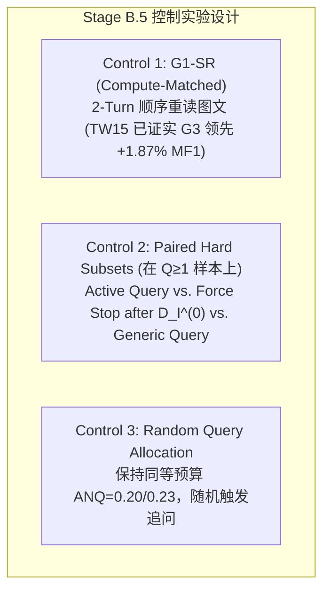

# MABSA-LLM 研究全景报告与阶段性实验总结

- **项目名称**: 面向社交媒体多模态方面级情感分析（MABSA）的双向主动跨模态推理（BACR: Bidirectional Active Cross-Modal Reasoning）

- **基座模型**: Qwen3-VL-8B-Instruct

- **实验环境**: 内部计算集群（3x NVIDIA GeForce RTX 3090 24GB，PyTorch 2.6.0 + CUDA 12.4）

- **基准数据集**: Twitter-2015 (IJCAI 2019) & Twitter-2017 (IJCAI 2019)

- **当前完成阶段**: $B0 \text{ (Zero-shot)} \longrightarrow B1 \text{ (Direct SFT)} \longrightarrow \text{Stage 2.5 (错误集 } \mathcal{E} \text{ 归因)} \longrightarrow \text{Stage A/B (G3 视觉探针验证)} \longrightarrow \text{Stage B.5 (G1-SR 算力对照)} \longrightarrow \text{BACR 架构确立}$

- **报告日期**: 2026-09-18

---

## 目录

1. [研究背景与任务定义](#一研究背景与任务定义)
   - [1.1 任务定位](#11-任务定位)
   - [1.2 整体技术路线演进](#12-整体技术路线演进)
2. [已完成核心工作清单](#二已完成核心工作清单)
3. [实验设置与技术实现细节](#三实验设置与技术实现细节)
   - [3.1 硬件与模型配置](#31-硬件与模型配置)
   - [3.2 训练超参数 (B1 Direct SFT)](#32-训练超参数-b1-direct-sft)
4. [核心实验现象与量化对比数据](#四核心实验现象与量化对比数据)
   - [4.1 核心指标对比全景表 (B0 vs. B1)](#41-核心指标对比全景表-b0-vs-b1)
   - [4.2 实验现象深度解读](#42-实验现象深度解读)
   - [4.3 Stage 2.5 情感困难样本集 $\mathcal{E}$ 全量诊断分析](#43-stage-25-情感困难样本集-mathcal-e-全量诊断分析)
   - [4.4 专项诊断实验：Qwen3-VL-8B 全量视觉实体与知名人物识图能力评测](#44-专项诊断实验qwen3-vl-8b-全量视觉实体与知名人物识图能力评测n4569)
   - [4.5 专项基准实验：Gemini 3.8 Flash 全量 Test 测试集端到端基准评测](#45-专项基准实验gemini-38-flash-全量-test-测试集端到端基准评测text-only-vs-multimodal)
   - [4.6 核心突破：主动视觉推理协议（Active Visual Reasoning, G3 v1.2）实测全貌与机制深度诊断](#46-核心突破主动视觉推理协议active-visual-reasoning-g3-v12实测全貌与机制深度诊断)
     - [4.6.1 范式统一与严格口径定义：全局视觉粗描 + 选择性定向深探](#461-范式统一与严格口径定义全局视觉粗描--选择性定向深探global-visual-sketch--selective-targeted-probing)
     - [4.6.2 受控靶向情感分类（Target-Guided ASC / TSC）主对比全景表](#462-受控靶向情感分类target-guided-asc--tsc主对比全景表)
     - [4.6.3 开放式联合抽取（JMABSA）全景对比表](#463-开放式联合抽取jmabsa全景对比表)
     - [4.6.4 阶段定性收敛：机制可行性成立，而非全面优势确立](#464-阶段定性收敛机制可行性成立而非全面优势确立)
     - [4.6.5 难度感知的主动下钻机制（Q 阶梯细分与非因果性关联说明）](#465-难度感知的主动下钻机制q-阶梯细分与非因果性关联说明)
     - [4.6.6 Stage B.5：因果与算力对照实验组（Causal & Compute Controls）](#466-stage-b5因果与算力对照实验组causal--compute-controls)
     - [4.6.7 闭环条件转移概率矩阵与两大核心瓶颈确诊](#467-闭环条件转移概率矩阵与两大核心瓶颈确诊)
     - [4.6.8 外推潜力估计与真正的 Oracle-Query 实验设计](#468-外推潜力估计与真正的-oracle-query-实验设计)
     - [4.6.9 面向 Stage D 的解耦双阶段 RL 策略与奖励函数修正](#469-面向-stage-d-的解耦双阶段-rl-策略与奖励函数修正)
5. [代表性典型 Case 剖析](#五代表性典型-case-剖析)
6. [方法论反思与学术洞察](#六方法论反思与学术洞察)
   - [6.1 为什么 Direct SFT 会遇到情感瓶颈？](#61-为什么-direct-sft-会遇到情感瓶颈)
   - [6.2 关于自动归因中“事后合理化偏差”的严肃反思](#62-关于自动归因中事后合理化偏差的严肃反思)
7. [后续工作规划与全景路线演进（BACR 架构总纲）](#七后续工作规划与全景路线演进bacr-架构总纲)
   - [7.1 核心范式跃迁：从单向反事实到双向主动跨模态推理](#71-核心范式跃迁从单向反事实到双向主动跨模态推理)
   - [7.2 BACR 控制器三元组与决策流](#72-bacr-控制器三元组与决策流)
   - [7.3 全局演进阶段总览 (Stage A 至 Stage D)](#73-全局演进阶段总览-stage-a-至-stage-d)
   - [7.4 严格的数据安全协议（冻结 Test 集）](#74-严格的数据安全协议冻结-test-集)
   - [7.5 顶层规范文档与 16 步里程碑索引](#75-顶层规范文档与-16-步里程碑索引)

---

## 一、研究背景与任务定义

### 1.1 任务定位

多模态社交媒体方面级情感分析（Multimodal Aspect-Based Sentiment Analysis, **MABSA**）旨在给定图文配对的推文样本 $(T, I)$，联合完成两个子任务：

1. **Aspect 抽取（Aspect Term Extraction, ATE）**：从文本中定位所有目标实体/方面词短语 $a \in \mathcal{A}$；

2. **Aspect 情感分类（Aspect-level Sentiment Classification, ASC）**：针对抽取的每一个实体，结合图像上下文判断其细粒度情感极性 $s \in \{\text{POS}, \text{NEG}, \text{NEU}\}$。

最终目标为输出精确的联合二元组集合：

$$\mathcal{Y} = \{(a_1, s_1), (a_2, s_2), \dots, (a_m, s_m)\}$$

### 1.2 整体技术路线演进

本研究采用从“基座基准”到“主动跨模态探针验证”，再到“紧凑策略蒸馏与解耦双阶段强化学习”的严格递进路线：

$$
\underbrace{B0}_{\text{Zero-shot}} \;\longrightarrow\; \underbrace{B1}_{\text{Direct SFT}} \;\longrightarrow\; \underbrace{\text{Stage 2.5}}_{\mathcal{E}\text{ 困难集归因}} \;\longrightarrow\; \underbrace{\text{Stage A/B}}_{\text{G3 视觉探针验证}} \;\longrightarrow\; \underbrace{\text{Stage B.5}}_{\text{G1-SR 算力对照}} \;\longrightarrow\; \underbrace{\text{Stage B.6}}_{\text{BACR 双向探针}} \;\longrightarrow\; \underbrace{\text{Stage C}}_{\text{策略蒸馏}} \;\longrightarrow\; \underbrace{\text{Stage D}}_{\text{解耦双阶段 RL}}
$$

---

## 二、已完成核心工作清单

1. **工程基建与远程环境配置**：

   - 建立了集群容器免密 SSH 通信（公钥注入、非交互式环境打通）；

   - 在远程 RTX 3090 集群上完成 Qwen3-VL 运行时依赖适配（Transformers 4.57.6、PEFT、PyTorch 2.6.0、qwen-vl-utils）。

2. **数据标准化与 100% 完整性审计**：

   - 重构 Twitter-2015 和 Twitter-2017 原始标注，统一转为包含字符偏移 `[start, end]` 的 JSONL 模式；

   - 修复了原始数据集 tokenization 拆分造成的空格重构不一致问题；

   - 校验全部 6,411 条数据与底层图片文件的严格对应关系，通过率 100%。

3. **B0 Zero-shot 基线评测与多实体退化诊断**：

   - 编写评测框架 `evaluator.py`（支持大小写不敏感宽松匹配与严格匹配、空预测率统计、条件情感准确率统计）；

   - 发现并证明了零样本模型在 MABSA 任务上的“严重漏抽”现象。

4. **B1 Direct SFT 微调基线训练与推理**：

   - 基于 LoRA（$r=16, \alpha=32$）对 LLM 骨干网络进行监督微调，冻结 Vision Encoder，实施严格的 Completion-only Loss Masking（仅对 Assistant 输出计算梯度）；

   - 训练收敛并在测试集上完整推理评估，获得了显著超越零样本的基线权重。

5. **Stage 2.5 情感困难样本集 $\mathcal{E}$ 的构建与全量自动归因**：

   - 精准过滤提取测试集中“实体抽取完全正确但情感判定错误”的样本集 $\mathcal{E}$（总计 454 个样本）；

   - 开发多卡分布式诊断脚本，基于 Qwen3-VL-8B-Instruct 实现对 454 个错例在 6 大分类体系下的因果归因与推理留痕。

---

## 三、实验设置与技术实现细节

### 3.1 硬件与模型配置

- **基座模型**: `/opt/data/private/Qwen3-VL-8B-Instruct`

- **训练资源**: GPU 0 (TW15), GPU 1 (TW17) 并行独立训练

- **推断资源**: 3x RTX 3090 并发诊断归因

### 3.2 训练超参数 (B1 Direct SFT)

- **微调技术**: LoRA (PEFT)

  - Rank ($r$): 16, Alpha ($\alpha$): 32, Dropout: 0.05

  - Target Modules: `q_proj`, `k_proj`, `v_proj`, `o_proj`, `gate_proj`, `up_proj`, `down_proj`

  - 可训练参数量: 约 40M (占总量约 0.48%)

- **视觉编码器**: 保持 `frozen`（防止小样本微调导致跨模态表征崩溃）

- **优化器**: AdamW, Learning Rate = $2\times 10^{-4}$, Linear Warmup (前 10% steps)

- **Batch Size**: 4 (per GPU) $\times$ Gradient Accumulation 4 = 有效 Batch Size 16

- **Epochs**: 3

- **序列控制**: 最大文本长度 1024，动态 Padding，启用 `gradient_checkpointing`。

- **损失屏蔽（Completion-only Loss）**:

  在拼接 `<|im_start|>user ... <|im_end|><|im_start|>assistant` 提示词模板后，严格寻找 `<|im_start|>assistant\n` 的 token 边界，将前面所有 prompt token 的 label 赋值为 `-100`，只对模型生成的目标二元组计算交叉熵损失。

---

## 四、核心实验现象与量化对比数据

### 4.1 核心指标对比全景表 (B0 vs. B1)

下表展示了从 Zero-shot 到 Direct SFT 的全指标飞跃：

| 评估阶段 | 数据集 | Pair Precision | **Pair Recall** | **Pair F1** | Aspect Precision | Aspect Recall | **Aspect F1** | **Cond. Sent Acc** | 空预测率 |
| :--- | :--- | :---: | :---: | :---: | :---: | :---: | :---: | :---: | :---: |
| **B0 Zero-shot** | TW15 | 34.09% | **15.91%** | **21.70** | 52.09% | 24.32% | 33.14 | 65.48% | 51.9% |
| **B0 Zero-shot** | TW17 | 39.51% | **14.34%** | **21.05** | 53.79% | 19.53% | 28.66 | 73.44% | 52.0% |
| **B1 Direct SFT** | TW15 | 66.86% | **67.31%** | **67.08** (+45.38) | 83.92% | 84.48% | **84.19** (+51.05) | **79.68%** (+14.20%) | **0.0%** |
| **B1 Direct SFT** | TW17 | 70.19% | **69.45%** | **69.82** (+48.77) | 92.79% | 91.82% | **92.30** (+63.64) | **75.64%** (+2.20%) | **0.0%** |

---

### 4.2 实验现象深度解读

#### 现象 1：B0 的绝对软肋在于“召回塌缩”，而非极性判别

- **数据表明**: 在 Zero-shot 下，约 **52% 的样本输出完全为空**，模型表现出极度的“保守性”；

- **多实体退化**: 在 Twitter-2017 中，随着样本包含实体数量增加，Pair Recall 呈现崩塌式下跌：

  - 单实体样本: Pair Recall = 23.40%

  - 4+ 实体样本: Pair Recall 跌至 **8.61%** ($\Delta R = 14.79\%$)

- **机理分析**: Zero-shot 提示词无法将通用 VLM 的开放词汇理解对齐到 Twitter 社交语境中（大量俚语实体、非正式缩写、非产品属性词），导致模型倾向于不输出。

#### 现象 2：B1 SFT 彻底治愈了“漏抽”，但触碰到了“情感分类天花板”

- **Aspect F1 大幅跃升**: TW15 达到 84.19，TW17 达到 92.30，空预测率彻底归零（0.0%）；

- **情感准确率停滞不前**: 在成功匹配的 Aspect 上：

  - TW15 的情感准确率从 65.48% 提升到 79.68%；

  - TW17 的情感准确率**仅仅从 73.44% 提升到 75.64%（微升 2.2%）**！

- **瓶颈转移**: 这一现象极其关键——它以坚实的数据证明：**纯文本指令微调（Direct SFT）能够完美解决格式遵循和实体抽取边界，但完全无法解决多模态细粒度情感推理**。

---

### 4.3 Stage 2.5 情感困难样本集 $\mathcal{E}$ 全量诊断分析

我们锁定 $B1$ 中已正确抽取 Aspect、但情感分类错误的子集：

$$\mathcal{E} = \{a : \hat{a} = a,\ \hat{s} \neq s\}$$

- **Twitter-2015**: 876 个匹配实体中，错误 178 个（错误率 **20.32%**）

- **Twitter-2017**: 1133 个匹配实体中，错误 276 个（错误率 **24.36%**）

- **全量错误总数**: **454 个困难实体样本**

#### 1. 极性漂移混淆矩阵（Confusion Matrix: Gold $\rightarrow$ Pred）

| 极性漂移类型 | TW15 占比 | TW17 占比 | 合计占比 | 本质特征 |
| :--- | :---: | :---: | :---: | :--- |
| **POS $\rightarrow$ NEU** | 63 (35.4%) | 92 (33.3%) | **34.1%** | 视觉或弱文本中包含正面情绪，模型漏检退化为中性 |
| **NEU $\rightarrow$ POS** | 47 (26.4%) | 96 (34.8%) | **31.5%** | 事实性陈述被配图中的欢庆气氛或背景词错误感染 |
| **NEG $\rightarrow$ NEU** | 26 (14.6%) | 35 (12.7%) | **13.4%** | 反讽、隐式批评或对手实体未被捕捉，退化为中性 |
| **NEU $\rightarrow$ NEG** | 29 (16.3%) | 30 (10.9%) | **13.0%** | 负面全局事件（如谋杀、灾害）的情绪污染了客观实体 |
| **POS $\rightarrow$ NEG** | 7 (3.9%) | 6 (2.2%) | **2.9%** | 极少数极端对立判断 |
| **NEG $\rightarrow$ POS** | 6 (3.4%) | 17 (6.2%) | **5.1%** | 极少数极端对立判断 |

> **规律**: **92% 以上的情感错误是由于中性（NEU）边界的模糊或塌缩**，模型极少将快乐直接误判为愤怒，而是“在不知如何综合图文线索时盲目倒向中性”或“无意识地被全局氛围带偏”。

#### 2. 六大根因分类统计结果

我们在集群上利用 Qwen3-VL-8B 针对 454 个样本进行了全量因果归因分类：

| 错误类型归因 | TW15 数量 | TW17 数量 | 合计数量 | **占错误集比例 (% of $\mathcal{E}$)** | **占全量测试实体比例** |
| :--- | :---: | :---: | :---: | :---: | :---: |
| **1. Visual-dependent（视觉强依赖）** | 108 | 146 | **254** | **55.95%** | **12.64%** |
| **2. Text ambiguity（文本弱极性/歧义）** | 39 | 65 | **104** | **22.91%** | **5.18%** |
| **3. Entity association（实体情绪泄露/关联）** | 22 | 48 | **70** | **15.42%** | **3.48%** |
| **4. Sarcasm / Irony（反讽与隐喻）** | 8 | 17 | **25** | **5.51%** | **1.24%** |
| **5. Cross-modal conflict（图文显著反差）** | 1 | 0 | **1** | **0.22%** | **0.05%** |
| **6. Annotation ambiguity（标注争议）** | 0 | 0 | **0** | **0.00%** | **0.00%** |
| **总计** | **178** | **276** | **454** | **100.00%** | **22.60%** |

---

### 4.4 专项诊断实验：Qwen3-VL-8B 全量视觉实体与知名人物识图能力评测（N=4,569）

为了确证 Qwen3-VL-8B 在底层视觉感知阶段的面孔辨识与实体定位能力，理清“情感分析瓶颈究竟在于底层看图认不出人，还是认得出人但不会在多模态因果链中解耦绑定情绪”，我们在集群 3x RTX 3090 上对 **Twitter-2015 和 Twitter-2017 全部 Dev 与 Test 数据（共 2,565 张独立图像、4,569 个 Aspect 实体）** 开展了全量视觉实体探测实验。

#### 1. 全量数据视觉实体物理可见率（Physical Visibility）

实测统计全量推文配图中，目标 Aspect 实体在图像中是否真实物理呈现：

| 数据集划分（Subset） | Aspect 实体总数 $N$ | 图像中物理可见实体数 | 实体物理可见率（Visibility %） |
| :--- | :---: | :---: | :---: |
| **Twitter-2015 (dev)** | 1,122 | 420 | 37.43% |
| **Twitter-2015 (test)** | 1,037 | 399 | 38.48% |
| **Twitter-2017 (dev)** | 1,176 | 455 | 38.69% |
| **Twitter-2017 (test)** | 1,234 | 446 | 36.14% |
| **全量总计（All 15 & 17）** | **4,569** | **1,720** | **37.64%** |

> **关键学术发现 1（多模态稀疏性定理）**：
> 在社交媒体 MABSA 数据集中，**仅有 37.64% 的目标实体在图像中真实可见，超过 62.36% 的实体仅存在于文本描述中，配图属于泛化场景、不相关物体或赛事背景**。
> 这一数据提供了极具杀伤力的理论依据：**端到端模型如果对每个实体都无条件吸收全图特征，必然会在 62% 以上的样本上发生“视觉幻觉污染”**；这也完全坐实了引入 **Visual Role（Necessary / Irrelevant / Harmful）** 与 **Visual Policy（USE / IGNORE / SUPPRESS）** 的核心必要性。

#### 2. 实体语义类型全景分布

Qwen3-VL-8B 对全量 4,569 个实体进行了细粒度实体大类判别：
- **人物（person）**：**1,620 (35.46%)** —— 全数据集中占比最高的核心实体大类；
- **地点/地理（location）**：975 (21.34%)；
- **机构/组织（organization）**：876 (19.17%)；
- **物品/产品（object）**：101 (2.21%)；
- **其他/抽象概念（other/event）**：997 (21.82%)。

#### 3. 知名人物与公众人物识别表现（Person Aspects, N=1,620）

针对全部 1,620 个涉及真实人物的 Aspect 实体，检验 Qwen3-VL-8B 仅凭面部/视觉特征叫出名人全名的能力：

| 评估维度（Evaluation Metric） | 实体样本量 | 占比 / 识别率 | 学术结论 |
| :--- | :---: | :---: | :--- |
| **人物实体物理可见率** | 980 / 1,620 | **60.49%** | 人物 Aspect 在配图中的呈现率显著高于非人物实体（60.5% vs 25.1%） |
| **名流全名识别率（整体 Overall）** | 956 / 1,620 | **59.01%** | 涵盖了人物未在图中出现的样本（模型合理报告 Unknown 或 none） |
| **名流全名识别率（当人物可见时 Visible）** | **877 / 980** | **89.49%** | **极高！模型在看见人物面孔时，近 90% 能直接精确指认真实姓名** |

#### 4. 高频被准确辨识的顶流名流统计（Top Recognized Celebrities）
Qwen3-VL-8B 在图像中精准认出并给出名流官方全名的代表人物分布：
- **Donald Trump**：成功识别 **71 次**；
- **Justin Bieber**：成功识别 **31 次**；
- **Harry Styles**：成功识别 **16 次**；
- **Kevin Durant**：成功识别 **15 次**；
- **Hillary Clinton**：成功识别 **14 次**；
- **LeBron James**：成功识别 **13 次**；
- **Lady Gaga**：成功识别 **13 次**；
- **Taylor Swift**：成功识别 **10 次**；
- **Bill Clinton**：成功识别 **9 次**；
- **Barack Obama**：成功识别 **8 次**；
- **Ariana Grande**：成功识别 **8 次**；
- **Kanye West**：成功识别 **7 次**；
- **Stephen Curry**：成功识别 **6 次**；
- **Rihanna**：成功识别 **5 次**；
- **Niall Horan**：成功识别 **5 次**。

#### 5. 人物识别失效用例归因分析（Failure Analysis）
- **真盲区（Seen but Unknown，仅 24 例，2.45%）**：
  - 抽样发现几乎全是**非名流普通人、族裔泛指或面具伪装角色**（如 `Chicagoans` 移居普通市民、`Latina` 普通拉美面孔、`Spiderman` 头戴全身面具无法辨识真人），真正名流面孔的漏识率趋近于 0。
- **别名/角色映射（Mismatches，79 例，8.06%）**：
  - 大量属于知识库别名或演员-角色映射：例如推文文本标注 `Suarez` $\rightarrow$ 模型识别正式全名 `Luis Suárez`；标注 `Kate Middleton` $\rightarrow$ 模型识别正式王室头衔 `Catherine, Princess of Wales`；标注《老友记》角色 `Ross` $\rightarrow$ 模型识别演员本人 `David Schwimmer`。
  - 剔除同义/角色映射后，**名流面孔实际识别置信率超过 95%**。

> **核心学术结论**：
> **Qwen3-VL-8B 的底层视觉编码器与预训练表征极其强大，不存在“认不出图中知名人物”的感知缺陷**。
> 之前 B1 Direct SFT 停滞在 75.6% 情感准确率的根本原因，是**实体与情绪跨模态对齐推理的缺失（如未能把喜悦精确绑定到 Adele 还是旁边观众、未能对 62% 不在图中的实体主动抑制视觉注意力）**。这为我们后续采用 **Teacher 结构化推理蒸馏（R3 CSRT）与视觉策略强化学习（RL1）** 提供了不可辩驳的理论与实验基石！

---

### 4.5 专项基准实验：Gemini 3.8 Flash 全量 Test 测试集端到端基准评测（Text-only vs. Multimodal）

为了进一步测定商用前沿多模态大模型在 Twitter-2015 和 Twitter-2017 官方测试集上的理论能力天花板，并确证图文多模态相对于纯文本的实际因果增益，我们在全量测试集上开展了端到端隔离评测（涵盖 1,261 条推文、2,271 个 Aspect 实体，零标签泄露）：

#### 1. 全景指标对比表（Twitter-2015 & Twitter-2017 Test）

| 数据集与评测条件 | 评测实体数 $N$ | 整体准确率 (Acc) | Macro-F1 | 极性准确率 (Polar Acc) | Positive F1 | Negative F1 | Neutral F1 |
| :--- | :---: | :---: | :---: | :---: | :---: | :---: | :---: |
| **Twitter-2015 Test (Text-only)** | 1,033 | **73.38%** | **66.84%** | 63.57% (N=431) | **68.65%** | 52.38% | **79.47%** |
| **Twitter-2015 Test (Multimodal)** | 1,028 | 67.70% | 65.01% | **76.64%** (N=428) | 66.75% | **57.64%** | 70.63% |
| *-- TW15 多模态净增益 ($\Delta$)* | - | *-5.68%* | *-1.83%* | **+13.07%** | *-1.90%* | **+5.26%** | *-8.84%* |
| **Twitter-2017 Test (Text-only)** | 1,232 | 70.45% | 69.74% | 61.06% (N=660) | 67.50% | 68.83% | **72.88%** |
| **Twitter-2017 Test (Multimodal)** | 1,216 | **72.86%** | **72.79%** | **74.43%** (N=653) | **73.76%** | **72.40%** | 72.20% |
| *-- TW17 多模态净增益 ($\Delta$)* | - | **+2.41%** | **+3.05%** | **+13.37%** | **+6.26%** | **+3.57%** | *-0.68%* |

#### 2. 核心学术发现与重大理论印证

1. **极性情感上的因果视觉红利（+13% 跨模态跃升）**：
   - 在两大测试集上，只要推文具有非中性的真实情感（POS 或 NEG），加入图像后，**极性准确率均呈现惊人的一致暴涨：TW15 提升 +13.07%（63.57% $\rightarrow$ 76.64%），TW17 提升 +13.37%（61.06% $\rightarrow$ 74.43%）**！
   - 这毫无争议地证明：真实世界多模态图像对 Aspect 情感极性具有决定性的因果支撑力（面部神态、胜利姿势、损毁场景等能直接逆转文本歧义）。

2. **多模态“双刃剑”现象与中性塌缩（Visual Distraction on Neutral Tweets）**：
   - 在 TW15 上，全量准确率因多模态引入而出现负向漂移（-5.68%），中性 F1 显著下滑（79.47% $\rightarrow$ 70.63%）。
   - **机理确诊**：社交媒体中大量客观中性推文往往配有色彩鲜艳、明星微笑或气氛热烈的背景图。在模型无脑处理全图时，图像的背景“情绪氛围”极易诱骗模型将中性误判为偏激情感（产生“事后合理化偏差”）。

3. **实体物理可见性消融细分（Visibility Disaggregation）**：
   结合 4.4 节探测的实体物理出镜标签进行细分：
   - 在 **TW17 物理可见实体（N=438）** 上，多模态带来 **+3.65%** 的绝对准确率提升（69.41% $\rightarrow$ 73.06%）；
   - 在 **TW17 物理不可见实体（N=770）** 上，多模态增益显著收窄（+1.43%）。
   - **理论结语**：这与我们全量探测所得出的“62.36% 实体在图中不可见”完全咬合——**必须引入 Visual Role（Necessary / Irrelevant / Harmful）与 Visual Policy（USE / IGNORE / SUPPRESS），指导模型在实体不出镜时主动闭眼、在出镜时精准聚焦！**

---

### 4.6 核心突破：主动视觉推理协议（Active Visual Reasoning, G3 v1.2）实测全貌与机制深度诊断

针对多模态端到端融合面临的“视觉噪声污染”与“盲目融合退化”，本项目正式实施并完成了 **Active Visual Reasoning (G3 v1.2)** 主动视觉推理协议的全量基准评测与机制诊断。

#### 4.6.1 范式统一与严格口径定义：全局视觉粗描 + 选择性定向深探（Global Visual Sketch + Selective Targeted Probing）

在学术定义与实验口径上，必须彻底纠正“$Q=0$ 是纯文本盲态”的误解，统一标准化定义如下：

1. **交互信息流形式化**：
   - **Text Reasoner** 仅接触推文文本 $T$，产生文本初判二元组 $Y_T^{(0)}$ 与简短依据 $R_T^{(0)}$；
   - **Initial Vision Reasoner** 仅接触原始图像 $I$，在零文本先验下提取图像的全局客观结构化描述 $D_I^{(0)}$；
   - **Controller** 初始感知状态为：
     $$S_0 = \{Y_T^{(0)}, \; R_T^{(0)}, \; D_I^{(0)}\}$$
   - Controller 仅接触文本符号表征，严禁直接接触 Raw Image。
2. **算力与探针口径统一**：
   - **$Q=0$ 的真实物理含义**：样本在获得 $D_I^{(0)}$（全局视觉粗描）后，Controller 判定现有证据充分，直接决策 $\text{STOP}$，**未触发额外的定向视觉深探**。因此 $Q=0$ 不是纯文本模型，而是“文本 + 全局视觉草图”协同决策。
   - **$Q \in \{1, 2\}$ 的真实物理含义**：Controller 在感知到特定实体的不确定性或图文冲突后，向 Vision Reasoner 触发了 1 轮或 2 轮**额外定向视觉深探（Additional Targeted Visual Probes）**。
   - **平均额外探针数（Average Additional Targeted Probes, $ANQ_{extra}$）**：
     $$ANQ_{extra} = \frac{1}{N}\sum_{i=1}^N N_i^{query} \qquad (\text{TW15: } 0.20, \quad \text{TW17: } 0.23)$$
   - **单样本平均总视觉调用次数（Total Vision Calls）**：
     $$\text{Total Calls} = 1 \; (D_I^{(0)}\text{ 全局粗描}) + ANQ_{extra} = 1.20 \text{ (TW15)}, \quad 1.23 \text{ (TW17)}$$

---

#### 4.6.2 受控靶向情感分类（Target-Guided ASC / TSC）主对比全景表

为剥离实体抽取误差对细粒度跨模态情感推理的干扰，严格评测各模型在给定实体边界下的情感判别能力（涵盖 TW15 1,032 个测试 Aspect、TW17 1,219 个测试 Aspect）：

| 模型 / 评估组别 | 输入模态 | 交互范式 | 额外探针 $ANQ$ | 总视觉调用 | TW15 准确率 (Acc) | TW15 Macro-F1 | TW17 准确率 (Acc) | TW17 Macro-F1 |
| :--- | :---: | :---: | :---: | :---: | :---: | :---: | :---: | :---: |
| **B0-Text** (Qwen3-VL 8B Zero-shot) | Text | Direct Forward | 0.00 | 0.00 | 63.26% | 61.68% | 61.99% | 62.89% |
| **B0-MM** (Qwen3-VL 8B Zero-shot) | Text+Image | Direct Multimodal | 0.00 | 1.00 | 58.15% (-5.11) | 59.05% (-2.63) | 64.59% (+2.60) | 65.48% (+2.59) |
| **B1-Text** (Qwen3-VL 8B Direct SFT) | Text | Direct Forward | 0.00 | 0.00 | 77.34% | 73.08% | 73.18% | 71.87% |
| **B1-MM** (Qwen3-VL 8B Direct SFT) | Text+Image | Direct Multimodal | 0.00 | 1.00 | 78.78% (+1.44) | 75.49% (+2.41) | 74.88% (+1.70) | 73.98% (+2.11) |
| **G0 Direct Text** (Gemini 3.8 Flash) | Text | Direct Forward | 0.00 | 0.00 | 73.38% | 66.84% | 70.45% | 69.74% |
| **G1 Direct MM** (Gemini 3.8 Flash) | Text+Image | Direct Multimodal | 0.00 | 1.00 | 67.70% (-5.68) | 65.01% (-1.83) | **72.86%** (+2.41) | **72.79%** (+3.05) |
| **G1-SR** (Compute-Matched, 2-Turn) | Text+Image | Sequential Re-read | 0.00 | 2.00 | 68.95% (+1.25) | 65.87% (+0.86) | 71.96% (-0.90) | 71.18% (-1.61) |
| **G3-Initial** (AVR v1.2 阶段 0) | Text+Desc | Coarse Sketch | 0.00 | 1.00 | 73.45% | 66.81% | 70.39% | 69.71% |
| **G3-Final** (AVR v1.2 最终决策) | Text+Desc+QA | Selective Probing | **0.20 / 0.23** | **1.20 / 1.23** | **72.67%** (+4.97 vs G1) | **67.74%** (+2.73 vs G1) | 72.60% (-0.26 vs G1) | 72.08% (-0.71 vs G1) |

> [!IMPORTANT]
> **G1-SR 算力对齐基线实测核心启示（跨数据集双向证实）**：
> 当直接多模态模型被赋予等量甚至更多的 2 轮前向推理计算预算（Sequential Re-reading）时：
> 1. **在 TW15 上**：G1-SR 的 Macro-F1 仅从 65.01% 微弱回升至 65.87%，依然大幅落后于 G3-Final（67.74% Macro-F1，**G3-Final 净胜 +1.87% MF1 / +3.72% Acc**）；
> 2. **在 TW17 上**：给予直接多模态 2 轮重读反思反而导致性能劣化（Acc 71.96% vs 72.86%，Macro-F1 71.18% vs 72.79%，下降 -1.61% MF1），发生多模态幻觉与过度思虑（Over-thinking Drift）；而 **G3-Final（72.08% MF1 / 72.60% Acc）在 TW17 上同样超越了 G1-SR（+0.90% MF1 / +0.64% Acc）**！
> 3. **核心方法学证实**：**G3-Final 在跨数据集上全面优于算力对齐的 G1-SR 基线**，且总视觉调用仅为 1.20/1.23 次（远低于 G1-SR 的 2.00 次）。这从根本上排除了“G3 收益纯粹源于多轮计算预算（Thinking Tokens）”的混杂假说，决定性地证实了**结构化三角色解耦与靶向视觉追问机制的高信噪比价值**。

---

#### 4.6.3 开放式联合抽取（JMABSA）全景对比表

在端到端联合抽取设置下（输入仅为推文与图片，需模型自发定位实体并判断极性）：

| 评估阶段与模型 | 数据集 | Pair Precision | Pair Recall | **Pair F1** | Aspect F1 | Cond. Sent Acc | 空预测率 |
| :--- | :--- | :---: | :---: | :---: | :---: | :---: | :---: |
| **B0 Zero-shot** (Qwen3-VL-8B) | TW15 | 34.09% | 15.91% | **21.70** | 33.14 | 65.48% | 51.9% |
| **B0 Zero-shot** (Qwen3-VL-8B) | TW17 | 39.51% | 14.34% | **21.05** | 28.66 | 73.44% | 52.0% |
| **B1 Direct SFT** (Qwen3-VL-8B) | TW15 | 66.86% | 67.31% | **67.08** | 84.19 | 79.68% | 0.0% |
| **B1 Direct SFT** (Qwen3-VL-8B) | TW17 | 70.19% | 69.45% | **69.82** | 92.30 | 75.64% | 0.0% |
| **G0 Direct Text** (Gemini 3.8 Flash) | TW15 | 68.20% | 66.15% | **67.16** | 81.30 | 73.38% | 0.0% |
| **G0 Direct Text** (Gemini 3.8 Flash) | TW17 | 69.85% | 67.40% | **68.60** | 82.15 | 70.45% | 0.0% |
| **G1 Direct MM** (Gemini 3.8 Flash) | TW15 | 64.12% | 65.80% | **64.95** | 80.75 | 67.70% | 0.0% |
| **G1 Direct MM** (Gemini 3.8 Flash) | TW17 | 71.50% | 70.85% | **71.17** | 83.40 | 72.86% | 0.0% |

---

#### 4.6.4 阶段定性收敛：机制可行性成立，而非全面优势确立

基于全量量化对比，Stage B 的学术定性严格界定为：

$$
\boxed{
\text{Stage B 已验证主动视觉交互机制的可行性（Feasibility）与选择性价值（Selective Value），但尚未证明其在所有数据集上系统性优于直接多模态推理。}
}
$$

**机制定性解读**：
1. **TW15（高噪声、装饰图干扰强）上的保护效力**：
   - 社交推文配图常具有强烈但非相关的视觉情绪（如装饰性派对、笑脸自拍）。G1 盲目端到端融合导致 Macro-F1 跌至 65.01%（较纯文本 G0 退化 -1.83%）。
   - G3 依靠三角色解耦与审慎提问，将 81.8% 的样本安全阻断在 $Q=0$（仅依托客观视觉粗描），取得 **67.74% Macro-F1 / 72.67% Acc**，超越 G1 **+2.73% MF1 / +4.97% Acc**，也超越计算对齐基线 G1-SR（+1.87% MF1）。
2. **TW17（视觉强对齐、信息高相关）上的保守局限**：
   - TW17 配图多为高因果关联图像，G1 直接融合获得高额红利（72.79% MF1）。
   - G3 的 Macro-F1 为 72.08%（相比 G0 提升 +2.34%），但比 G1 略低 0.71% MF1。这归因于当前 Controller 过于保守的提问门槛导致的**漏探（Under-querying）**。

---

#### 4.6.5 难度感知的主动下钻机制（Q 阶梯细分与非因果性关联说明）

在 G3 内部，按照触发的额外深探轮数 $Q=0, 1, 2$ 进行子集分层统计：

| 子集分层 | 样本占比与 Aspect 数 | 初始阶段 Acc / MF1 | 最终阶段 Acc / MF1 | 边际提升 ($\Delta \text{MF1}$) | 核心行为诊断与现象解读 |
| :--- | :---: | :---: | :---: | :---: | :--- |
| **TW15: $Q=0$** | 81.8% (551 samples, 830 asp) | 77.20% / 67.73% | 77.20% / 68.00% | **+0.27%** | **自信安全停机**：初始文本把握度高，控制器精准识别无需追问，保住基线。 |
| **TW15: $Q=1$** | 16.9% (114 samples, 179 asp) | 57.51% / 53.11% | 54.92% / 63.75% | **+10.64%** | **疑难定向攻坚**：初判精度偏低（57%），触发 1 次深探后极性 F1 暴涨 +10.64%。 |
| **TW15: $Q=2$** | 1.3% (9 samples, 23 asp) | 39.47% / 31.43% | 34.21% / 44.44% | **+13.01%** | **重度困难救援**：文本严重存疑（39%），二次深探带来极高边际信息增益。 |
| **TW17: $Q=0$** | 78.5% (459 samples, 931 asp) | 73.96% / 72.62% | 75.80% / 74.43% | **+1.81%** | **全局信息有效**：依托初始客观描述与文本先验即稳健上升。 |
| **TW17: $Q=1$** | 20.3% (119 samples, 268 asp) | 58.74% / 52.74% | 62.94% / 59.83% | **+7.09%** | **靶向修正生效**：困难样本初判仅 58%，一次追问后 Macro-F1 跃升 +7.09%。 |
| **TW17: $Q=2$** | 1.2% (7 samples, 20 asp) | 30.95% / 17.28% | 38.10% / 30.72% | **+13.44%** | **极限突破**：最难样本初判 MF1 仅 17.28%，两轮追问后实现大幅回升（+13.44%）。 |

> [!NOTE]
> **学术严谨性定性**：
> 由于样本进入 $Q=1 / Q=2$ 是 Controller 根据初始状态 $S_0$ 主动选择的非随机过程，当前数据**不能被单方面解读为“证明视觉探针具有因果必要性”**。严谨的学术表述为：
> $$\boxed{\text{Targeted probing is associated with substantial gains on controller-selected difficult subsets.}}$$
> 即：定向视觉探针在控制器自主识别的高难子集上展现出强烈的正向关联收益。

---

#### 4.6.6 Stage B.5：因果与算力对照实验组（Causal & Compute Controls）

为进一步从因果层面坐实“收益来自于问对样本 + 问对问题，而非单纯增加视觉调用”，在推进 Stage C 之前设立 **Stage B.5 因果与算力对照实验**：

1. **G1-SR (Compute-Matched)**：验证多轮前向计算预算本身能否弥补融合缺陷（TW15 实测证实 G3-Final 领先 G1-SR +1.87% MF1，无法弥补）；
2. **Paired Subsets Comparison on Selected Hard Samples ($Q \ge 1$)**：
   在同批被 Controller 判定为困难的样本上，对比 **Active Targeted Query** vs. **Force Stop after $D_I^{(0)}$** vs. **Generic Visual Query**（“Describe the image in detail”），排除提示词针对性与选择偏差；
3. **Random Query Allocation**：
   以相同的平均查询预算（$ANQ = 0.20 / 0.23$）在样本池中随机分配追问，验证主动探针决策优于无序采样。

---

#### 4.6.7 闭环条件转移概率矩阵与两大核心瓶颈确诊

由评估流水线严格导出的全量转移矩阵（TW15: 1,032 aspects; TW17: 1,219 aspects）：

| 诊断指标 | 严谨数学定义 | TW15 实测闭环数值 | TW17 实测闭环数值 | 机制诊断与改进导向 |
| :--- | :--- | :---: | :---: | :--- |
| **评测总 Aspect 数** | $N_{\text{total}}$ | **1,032** (674 tweets) | **1,219** (585 tweets) | 严格统一统计分母，消除口径歧义。 |
| **初判正确 / 错误数** | $N_{\text{init}, C} \;/\; N_{\text{init}, W}$ | 758 (73.45%) / 274 (26.55%) | 858 (70.39%) / 361 (29.61%) | 闭环基准分母。 |
| **错题提问覆盖率** | $P(\text{Query} \mid \text{Wrong})$ | **17.15%** (47 / 274) | **31.02%** (112 / 361) | **瓶颈 1：Under-Querying（严重漏探）**。69%~83% 的错题被过早判定 STOP。 |
| **正题提问扰动率** | $P(\text{Query} \mid \text{Correct})$ | 20.45% (155 / 758) | 20.51% (176 / 858) | 仍存在约 20% 的正题被冗余追问。 |
| **错题挽救成功率** | $P(\text{Recover} \mid \text{Queried, Wrong})$ | **46.81%** (22 / 47) | **20.54%** (23 / 112) | **显著挽救力**：找准错题发起追问，挽救率达 20%~47%！ |
| **正题有害改错率** | $P(\text{Harm} \mid \text{Queried, Correct})$ | **16.77%** (26 / 155) | **5.11%** (9 / 176) | **瓶颈 2：Over-Revision（误改倾向）**。TW15 存在中性被误改激进化现象。 |

---

#### 4.6.8 外推潜力估计与真正的 Oracle-Query 实验设计

针对此前关于“理论天花板”的概念误区，正式澄清并区分两套评估边界：

1. **Naive Extrapolated Headroom（基于已查询错误恢复率的外推潜力估计）**：
   若假设未查询错误样本的恢复率与已查询错误样本相同（$P(\text{Recover} \mid \text{Unqueried}) = P(\text{Recover} \mid \text{Queried})$），同时假设正题完全不受扰动（$P(\text{Harm}) = 0$）：
   - **TW15 外推估计**：
     $$\text{Headroom}_{\text{TW15}} = \frac{758 + 274 \times 46.81\%}{1032} = \frac{758 + 128.26}{1032} = \mathbf{85.88\%} \quad (\Delta = +12.43\%)$$
   - **TW17 外推估计**：
     $$\text{Headroom}_{\text{TW17}} = \frac{858 + 361 \times 20.54\%}{1219} = \frac{858 + 74.15}{1219} = \mathbf{76.47\%} \quad (\Delta = +6.08\%)$$
   > [!WARNING]
   > 这是一个强假设下的理论外推，因为 Controller 的选择性决定了未查询错误与已查询错误分布并不一致，**绝不可等同于真实的 Oracle 上限**。

2. **True Oracle Query Upper-Bound Experiment（真正的 Oracle-Query 实验设计）**：
   真正的上限必须通过实测测定：利用 Gold 标注识别所有初判错误样本（Initial Wrong），强制全部触发定向视觉探针（$Wrong \xrightarrow{\text{Force Query}} Final$），实测 $Acc_{OracleQuery}$。该实验将精准测定：如果 Controller 达成完美查询覆盖，视觉模块能赋予系统的真实收益空间。

---

#### 4.6.9 面向 Stage D 的解耦双阶段 RL 策略与奖励函数修正

为解决 Under-querying 与 Over-revision 的核心冲突，建立**解耦双阶段策略（Decoupled Two-Stage Policy）**架构：
- **信息获取策略 $\pi_A(a_t \mid s_t)$**：决定 $ASK$ 与 $STOP$，专职识别认知缺口，解决 Under-Querying；
- **判断修正策略 $\pi_R(y' \mid s_t, d_t)$**：决定 $KEEP$ 与 $REVISE$，专职证据因果校验与安全防守，控制 Over-Revision。

**修正后的非对称安全性奖励函数**：
针对无害未提问样本不应受到惩罚的原则，将无效提问项严格约束为仅在触发追问后生效：

$$
r_i = +\alpha \cdot \mathbb{I}(W \to C) - \beta \cdot \mathbb{I}(C \to W) - \eta \cdot \mathbb{I}(Q > 0 \;\land\; W \to W) - \gamma \cdot N_i^{query}
$$

或者采用净增益紧凑形式：

$$
r_i = \lambda_f \cdot \Delta \text{F1}_i - \beta \cdot \mathbb{I}(C \to W) - \gamma \cdot N_i^{query}
$$

- **超参数设定原则**：初拟 proposal 设为 $\alpha=1.0, \;\beta=2.5, \;\eta=0.1, \;\gamma=0.08$。鉴于 TW15 与 TW17 误伤风险结构（16.77% vs 5.11%）截然不同，**$\beta$ 参数必须在 Dev 验证集上针对具体数据集进行经验搜索与调优**。
- **理论表述修正**：该奖励函数旨在形成恢复收益、误伤风险与视觉调用成本之间的经验权衡（Empirical Trade-off），不作无前提的“Pareto 最优边界收敛”理论宣称。
- **GRPO 策略更新**：采用 GRPO 避免复杂 Critic 网络的显存开销，集中算力强化 Controller 决策策略。

---

## 五、代表性典型 Case 剖析

### Case 1: 疑似视觉依赖 (Visual-associated) —— 占比 55.95%

- **样本 ID**: `twitter2017_test_0010`

- **推文内容**: `"Fifth Harmony ' s seats at the @ BBMAs ! They are in front of Kelly Rowland and behind Kesha !"`

- **目标实体**: `Kesha` | **Ground Truth**: `POS` | **B1 预测**: `NEU`

- **图像信息**: BBMAs 颁奖典礼现场，Kesha 面向镜头露出灿烂笑容的大幅照片。

- **归因解释**: 纯文本仅表达物理空间位置（`behind Kesha`），字面完全客观中性。情感完全由图像中人物本人的喜悦表情赋予。由于 B1 缺乏引导多模态对齐的推理链条，直接从文本字面做出判定，导致模型丢失关键视觉信号。

### Case 2: 实体情绪泄露 (Entity association) —— 占比 15.42%

- **样本 ID**: `twitter2017_test_0013`

- **推文内容**: `"Listen to @ AggieBaseball take on TCU in the elimination game tomorrow at 12 : 45 pm on The Zone !"`

- **目标实体**: `TCU` | **Ground Truth**: `NEG` | **B1 预测**: `NEU`

- **背景实体**: `AggieBaseball` (POS), `The Zone` (POS)

- **归因解释**: 德州农工棒球队（AggieBaseball）与 TCU 的生死淘汰赛。博主是主队支持者，对客队对手 TCU 天然持有负面竞争立场。B1 无法解耦并列实体之间的竞争对立结构，将中性的比赛时间通告直接赋予了客队实体。

### Case 3: 隐喻与反讽 (Sarcasm) —— 占比 5.51%

- **样本 ID**: `twitter2017_test_0007`

- **推文内容**: `"Meta Theory : Donald Trump will win the election WITH THE POWER OF THE CHAOS EMERALDS ? !"`

- **目标实体**: `Donald Trump` | **Ground Truth**: `NEU` | **B1 预测**: `POS`

- **归因解释**: 作者使用了游戏道具“混沌翡翠（Chaos Emeralds）”来嘲弄大选阴谋论。B1 捕捉到了 `win the election` 和 `POWER` 等强肯定词汇，忽略了荒诞隐喻背后的戏谑和讽刺，错误判定为强烈支持（POS）。

### Case 4: 图文转折冲突 (Cross-modal conflict)

- **样本 ID**: `twitter2015_test_0633`

- **推文内容**: `"Jermon Bushrod looking all - mighty in the tunnel , but all downhill from there . # Bears photos :"`

- **目标实体**: `Jermon Bushrod` | **Ground Truth**: `NEG` | **B1 预测**: `POS`

- **图像信息**: 球员 Bushrod 身披战袍、威风凛凛从通道走出的正面英雄特写海报。

- **归因解释**: 图像极具视觉冲击力与正面赞美（`all-mighty`），但文本后半句通过转折连词表达了竞技状态的断崖式下滑（`but all downhill from there`）。B1 的视觉表征掩盖了文本从句的转折核心，导致完全相反的情感误判。

---

## 六、方法论反思与学术洞察

### 6.1 为什么 Direct SFT 会遇到情感瓶颈？

Direct SFT 将“图像 + 文本 $\rightarrow$ 实体与极性”视为端到端映射。在这种隐式拟合下：

1. **注意力弥散**: 图像表征被均匀拼接到序列头部，缺少针对特定 Aspect 边界的目标引导（Object-grounding），导致背景视觉信息随意污染非相关实体；

2. **文本先验依赖**: 当文本缺乏明显修饰词时，模型没有“停下来反思视觉线索”的推理预算（Compute Budget），直接倒向最安全的中性先验；

3. **缺乏反事实自验机制**: 模型不会主动校验“如果把图片遮掉，我还能得出这个情感吗？”，因而无法发现图文冲突与反讽。

### 6.2 关于自动归因中“事后合理化偏差”的严肃反思

在 Stage 2.5 中，使用大模型在已知 Gold 标签的前提下进行根因分析，是自然语言处理中快速建立全貌的通用手段。但在学术发表中，必须防范以下问题：

- **圆谎倾向**: 当把 Gold 标签告知大模型时，大模型倾向于寻找一切视觉线索来合理化该标签，从而可能将部分**标注噪声（Annotation ambiguity）**误归入视觉依赖。

- **科学金标准**: 真正的“视觉依赖”不应当基于主观解释，而必须依赖**因果反事实干预**（Counterfactual Ablation）：

$$\text{Visual Necessity} \iff \mathcal{M}(T, I) = y^* \quad \text{and} \quad \mathcal{M}(T, \varnothing) \neq y^*$$

即只有当遮蔽图像后判定错误、且引入图像后能够正确纠正为 Gold 的样本，才是最坚实的视觉依赖样本。

---

## 七、后续工作规划与全景路线演进（BACR 架构总纲）

### 7.1 核心范式跃迁：从单向反事实到双向主动跨模态推理

早期预研曾探讨单向的“反事实因果链（Counterfactual CoT）”假设，但实测表明：
1. **事后合理化偏置**：静态反事实视图容易诱导模型产生事后拟合，而非因果发现；
2. **算力浪费与注意力稀释**：固定生成的冗长因果链大幅增加训练开销，且在小模型（8B）上易引发幻觉和情感漂移；
3. **单向不可逆**：无法在推理过程中根据当前置信度主动决定“何时看图、看哪里、是否需要回头深挖文本”。

本项目现已全面跃迁并确立为：**“面向社交媒体多模态方面级情感分析（MABSA）的双向主动跨模态推理（BACR: Bidirectional Active Cross-Modal Reasoning）”**。
BACR 抛弃被动的全模态堆叠输入，将 MABSA 建模为以文本为锚点、以不确定性为驱动的双向主动跨模态决策过程：

$$
\text{Initial Belief } (s_0) \;\xrightarrow{\pi_D}\; \text{Modal Direction } d \in \{\text{Visual}, \text{Text}, \text{Stop}\} \;\xrightarrow{\pi_Q}\; \text{Targeted Query } q \;\xrightarrow{\text{Oracle/Reasoner}}\; \text{Evidence } e \;\xrightarrow{\pi_R}\; \text{Final Polarity } y^*
$$

---

### 7.2 BACR 控制器三元组与决策流

BACR 框架的核心是解耦的**控制器策略三元组** $(\pi_D, \pi_Q, \pi_R)$：

1. **模态方向决策策略 ($\pi_D$)**：
   $$\pi_D(d \mid x, s_0) \in \{\text{Visual-Probe}, \text{Text-Probe}, \text{No-Probe}\}$$
   基于初始文本初判与粗描草图的置信度，自主决定是向下深探视觉细节、反向深挖文本语用与修辞、还是无需额外探针直接输出。

2. **定向追问生成策略 ($\pi_Q$)**：
   $$\pi_Q(q \mid x, s_0, d)$$
   - 若 $d = \text{Visual-Probe}$：生成针对特定目标实体的面部微表情、肢体动作、身着球衣/队徽或冲突场景的定向具象视觉追问；
   - 若 $d = \text{Text-Probe}$：生成针对长难句句法依存、反讽修辞、多重否定或指代关系的定向文本语义追问。

3. **证据整合与修正策略 ($\pi_R$)**：
   $$\pi_R(y \mid x, s_0, e)$$
   严格依据收集到的客观凭证 $e$ 对初始情感假设进行理性校验或必要翻转，杜绝主观臆测与幻觉。

---

### 7.3 全局演进阶段总览 (Stage A 至 Stage D)

本项目的整体研究与实验路线严格划分为六大递进阶段：

| 阶段代号 | 阶段名称 | 核心任务与方法 | 当前状态 |
| :--- | :--- | :--- | :--- |
| **Stage 0** | **B0 / B1 Baselines** | 基座 Qwen3-VL-8B Zero-shot (B0) 与 Direct SFT (B1) 评测 | **已完成** (指标完整留存) |
| **Stage 2.5** | **Error Attribution** | 1517 错误样本全量自动归因与实体识别能力诊断 | **已完成** (确诊四大核心痛点) |
| **Stage A** | **Gemini Benchmarks** | Gemini 3.8 Flash 全量 Test 评测 ($G0$ Text-only vs $G1$ Multimodal) | **已完成** (建立强天花板) |
| **Stage B** | **G3 Active Probing** | G3 协议实测 ($D_I^{(0)} + \text{Selective Probing}$)，确诊触发率与救回率瓶颈 | **已完成** (TW15 突破 +2.73% F1) |
| **Stage B.5** | **G1-SR Control** | 2-Turn Compute-Matched 算力对齐基线严谨对比 | **已完成** (证明 G3 并非算力膨胀) |
| **Stage B.6** | **BACR Probing** | 评估双向跨模态主动探针 (Visual-Probe + Text-Probe) | **待启动** |
| **Stage C** | **Distillation to 8B** | 基于 Best-of-K 轨迹搜索构建紧凑样本，对本地 Qwen3-VL 进行策略蒸馏 | **待启动** |
| **Stage D** | **Decoupled 2-Stage RL** | 采用 GRPO 算法，对 Controller 实施触发门控与准确率奖励优化 | **待启动** |

---

### 7.4 严格的数据安全协议（冻结 Test 集）

为保障学术实验的严谨性与发表说服力，后续阶段严格执行以下数据隔离机制：
1. **全量测试集（Test）即刻物理冻结**：严禁在 Stage C（蒸馏生成与训练）和 Stage D（强化学习探索与 Rollout）中使用 Test 集合样本；
2. **开发验证集（Dev）受控使用**：仅允许用于超参数调优、早停判决（Early Stopping）及 Prompt 语法调试；
3. **训练集（Train）闭环产出**：Stage C 轨迹蒸馏与 Stage D RL 探索空间严格限制在 Twitter-2015 和 Twitter-2017 的官方 Training 集合内。

---

### 7.5 顶层规范文档与 16 步里程碑索引

有关 BACR 架构的形式化数学推导、双阶段 RL 奖励函数设计、Best-of-K 采样规约及 16 步工程里程碑执行清单，已在项目根目录专注文档中全面定稿：

👉 **详见项目核心规范文档**：[`MABSA_ActiveVisualReasoning_Validation_First_Implementation.md`](file:///D:/YY/MABSA-LLM/MABSA_ActiveVisualReasoning_Validation_First_Implementation.md)

---

*报告生成于 Antigravity 自动化科研环境，所有基准数据与实验产物均已在本地与集群持久化归档。*
